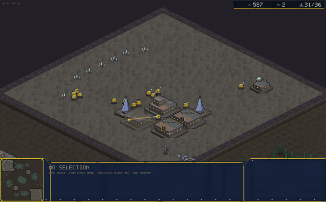
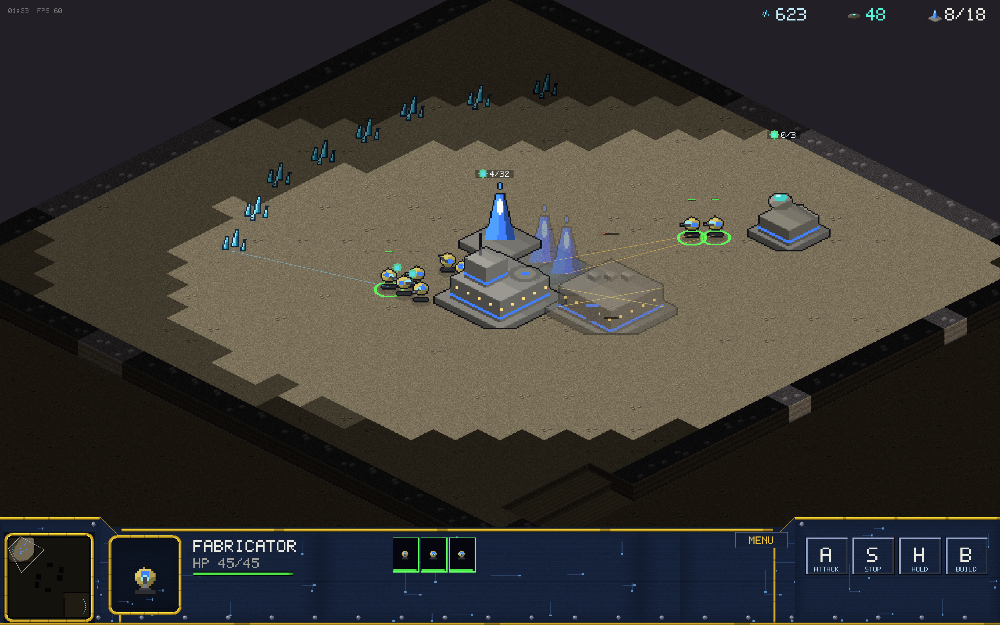
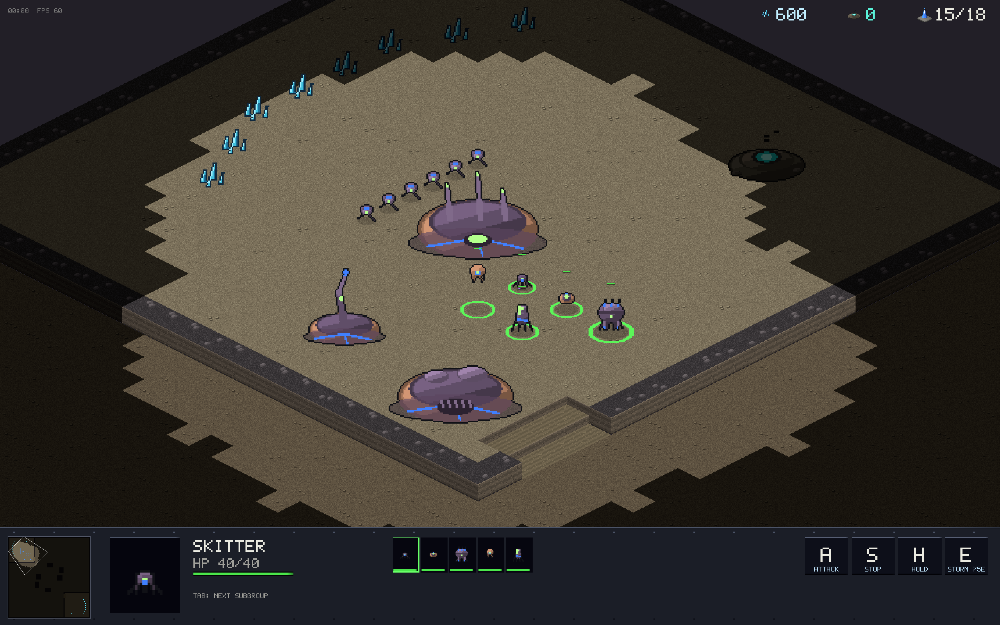

# Orion

A StarCraft-style RTS built from scratch in Rust. No game engine — a
purpose-built deterministic simulation with a wgpu isometric renderer.
Two asymmetric races, skirmish AI, and online multiplayer via lobby codes.
All art and audio are procedurally generated at startup: zero asset files.



|  |  |
|---|---|
| *Vanguard Combine massing for a push* | *The Kyth Assembly swarm* |

## Install

Grab the latest build from **[Releases](../../releases)** — everything is
precompiled, no install step:

| OS | File | Steps |
|---|---|---|
| macOS (Apple Silicon + Intel) | `Orion-macOS.zip` | Unzip → double-click **Orion.app**. First launch only: right-click → Open (it isn't notarized) |
| Windows 10/11 | `orion-windows-x86_64.zip` | Unzip → double-click **orion.exe**. If SmartScreen objects: More info → Run anyway |
| Linux (x86_64) | `orion-linux-x86_64.tar.gz` | `tar xzf && ./orion` (needs Vulkan drivers + ALSA `libasound2`) |

Multiplayer needs zero setup and never shows an IP: **FIND MATCH** pairs you
with a stranger near your skill and latency (ranked, Elo-rated); **CREATE
LOBBY** lists your game for anyone to click and join; **CREATE PRIVATE
LOBBY** gives you a 5-letter code that doubles as the password. Settings
live in `~/.orion-settings.ron`.

**Build from source** (any platform, Rust 1.80+):

```sh
# Linux build deps: sudo apt-get install libasound2-dev
cargo run --release -p orion-client
```

Releases are cut by pushing a tag: `git tag v0.x.y && git push origin v0.x.y`
— CI builds all three platforms and attaches them to the GitHub release.

See [SPEC.md](SPEC.md) for the full product specification and
[CLAUDE.md](CLAUDE.md) for architecture.

## Status

Playable game — single player vs AI, or 1v1 multiplayer (direct connect):

- Full macro loop: minerals + plasma (gas) → build → tech → army → destroy
  the enemy base
- **Two asymmetric races**, authored entirely in `crates/sim/assets/units.ron`:
- Vanguard Combine (industrial):
  - Units: Fabricator (worker), Trooper, Vanguard (melee), **Breaker (siege
    tank with deploy mode + splash)**, **Skywing (flyer, hits air+ground)**,
    **Stormcaller (spellcaster: Plasma Storm AoE)**
  - Buildings: HQ, Supply Pylon, Muster Hall, Plasma Condenser, **Forge
    (tanks)**, **Aerie (flyers)**, **Archive (research: Weapons/Armor +1/+2)**
  - Tech tree requirements (Forge needs Muster Hall, Aerie needs Forge,
    Stormcaller needs Archive)
- **Kyth Assembly** (swarm): Drone, Skitter (cheap fast melee), Spitter
  (ranged anti-air), Ravager (splash melee heavy), Wisp (flyer), Weaver
  (caster); Hive / Spire / Sap Well / Warren / Incubator / Roost / Cortex
- **Multiplayer**: a live **lobby browser** (public games listed by player
  name, one click to join) and **private lobbies** whose 5-letter code is
  the password — all through a Cloudflare Worker relay, no IPs, no port
  forwarding. WebSocket lockstep, input-delay 4 ticks, checksum desync
  detection; menus don't pause MP
- **Ranked matchmaking**: FIND MATCH queues you by MMR (Elo, K=32, start
  1200) *and* latency — the search window widens the longer you wait. No
  bots, humans only; matches are made on a random map from the pool, both
  players report the result and the matchmaker updates your rating (a
  rage-quit resolves against the quitter on a timeout). Your MMR shows on
  the FIND MATCH button and the end-of-match screen
- Race select + enemy race choice on the difficulty screen
- End-of-match stats (time, units built/lost, resources mined)
- Bot personalities (seeded timing/cap offsets) so games vary; escalation so
  they always finish; balance measured by
  `cargo run --release -p orion-sim --example balance`
- Two maps: "Meridian" (two high-ground mains, ramps, chokepoints) and
  "Caverns" (Xel'Naga Caverns homage: NE/SW mains, NATURAL EXPANSIONS with
  their own mineral lines + geysers, cavern rocks splitting the center into
  three routes) — pick per game; bots expand to their natural
- Replays: every game auto-saves to ~/.orion-replays; watch from the
  REPLAYS menu with pause, speed, and per-player fog perspective
- Main menu (vs AI at three difficulties), pause menu with settings:
  fullscreen, HUD size, game speed, edge scroll, rebindable hotkeys
  (persisted to `~/.orion-settings.ron`)
- Skirmish bot at Easy / Normal / Hard (no cheating — difficulty is macro
  tightness and aggression timing)
- Order queueing (shift), control groups, ctrl+click type-select, rally
  points with auto-gather, production queue with cancel/refund
- Worker-friendly macro UX: placements spread across selected workers (5
  workers + 3 queued buildings = 3 peel off, 2 keep mining), order-queue
  lines show each worker's plan (build sites, gather targets), mining chip
  sparks + construction weld arcs, saturation labels over bases and
  extractors (workers / cap)
- Hover tooltips on every HUD element (units, buildings, research, actions)
- Procedural audio: ambient music loop + combat/UI/economy sound effects,
  all synthesized at startup (no asset files); volume sliders in settings
- Flashing warnings with error sounds: NOT ENOUGH MINERALS / PLASMA /
  SUPPLY / ENERGY, CANNOT BUILD THERE, REQUIRES <building>
- Deterministic lockstep sim (fixed-point math, checksums, input-only
  mutation) — the property online multiplayer stands on

## Run

```sh
# Play vs the bot
cargo run --release -p orion-client

# Headless bot-vs-bot game with status log
cargo run --release -p orion-sim --example botgame

# 200-unit pathing stress benchmark
cargo run --release -p orion-sim --example stress

# Render-stack smoke test (opens window 3s, exits)
cargo run --release -p orion-client -- --smoke

# Screenshot of a bot game at tick N (visual verification without a human)
cargo run --release -p orion-client -- --shot out.ppm --shot-ticks 6480 \
    [--map caverns] [--shot-zoom 3.0] [--shot-focus 40,40] [--shot-reveal]

# Replay tools: record headless, watch, or capture a frame + checksum
cargo run --release -p orion-sim --example mkreplay -- game.ron 42
cargo run --release -p orion-client -- --replay game.ron
cargo run --release -p orion-client -- --replay-shot game.ron:out.ppm:6000

# Scripted human-play test: builds a base through the real command path,
# captures a frame series, asserts the buildings went up
cargo run --release -p orion-client -- --script prefix

# THE QA workhorse: N full bot matches headless with invariant checks,
# shadow-determinism runs, balance report and per-game CSV. Non-zero exit
# on any violation.
cargo run --release -p orion-sim --example soak -- 32 report.csv

# Balance-only summary across matchups
cargo run --release -p orion-sim --example balance

# Multiplayer smokes: two processes over LAN loopback or the live relay
orion-client --mp-auto host & orion-client --mp-auto join
orion-client --mp-auto host-relay:CODE & orion-client --mp-auto join-relay:CODE
```

All art is generated at startup — procedural SC1-style pixel sprites (units
with 8 facings and walk animation, structured buildings, cliff faces, mineral
crystals). There are no asset files to install.

## Controls

All game hotkeys are rebindable in Settings (Escape menu). Defaults:

| Input | Action |
|---|---|
| Left click / drag | Select / box-select |
| Ctrl+click / double-click | Select all units *or buildings* of that type on screen |
| Shift + click | Add/remove a unit from the selection |
| Shift + right click | Queue waypoint orders (also queues worker builds) |
| Right click | Move / attack / gather / resume construction / set rally |
| A + click | Attack-move |
| S / H | Stop / Hold position |
| B, then Q/W/E/R | Build grid: Pylon / Muster Hall / HQ / Condenser (SC2-style card with icons) |
| Q / W | Train (fills the shortest queue across selected buildings) |
| Click queue icon | Cancel queued unit (full refund) |
| Ctrl+# / Shift+# / # | Set group / add to group / select group |
| # twice | Jump camera to the group |
| Space | Jump to last under-attack alert |
| Backspace | Cycle your bases |
| F1 | Select idle worker |
| Arrows / edge / middle-drag | Pan camera (bounded to the map) |
| Scroll | Zoom |
| D | Siege / unsiege Breakers |
| E | Plasma Storm (Stormcaller selected), then click target |
| Tab | Cycle subgroup in a mixed selection |
| X | Cancel construction (75% refund) |
| Esc | Cancel mode, or open the pause menu |
| R | Restart (after game over) |
| F3 | Toggle fog reveal (dev) |

Economy: minerals from crystal fields; **plasma (gas)** from a Condenser built
on a geyser — advanced units cost both. Rally a production building onto a
resource and new workers start harvesting automatically. Fog is SC2-style:
terrain is always visible (dimmed), units and enemy buildings only when scouted.

## Test

```sh
cargo test --workspace
```

The tests that matter most: `determinism.rs` proves bit-identical simulation
from identical inputs (the property lockstep multiplayer stands on), and the
`stress` example enforces the sim tick budget with 200+ units.

## Deploy

Desktop binaries are cut by CI on `v*` tags (see Install above). The only
server component is the Cloudflare Worker relay in `relay/` (lobby directory +
WebSocket forwarding, free tier): `cd relay && npx wrangler deploy`. The
client's relay URL lives in `~/.orion-settings.ron` (`relay_url`). Ranked
matchmaking (1v1 queue) is specified in SPEC.md but not built yet.
