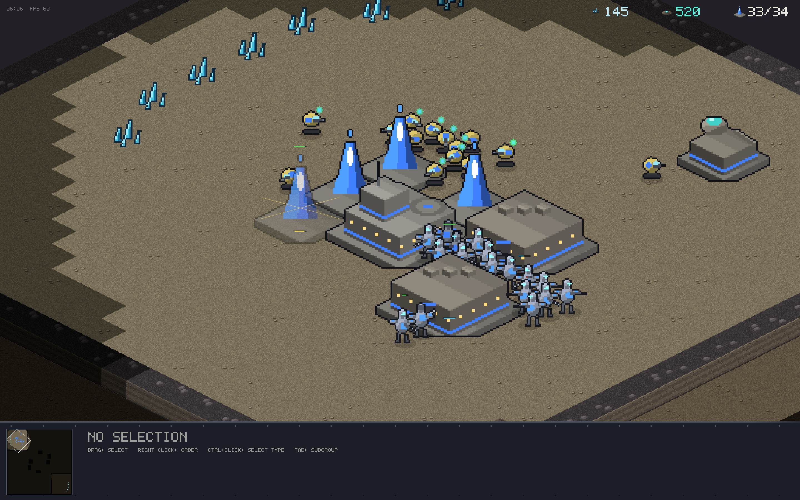
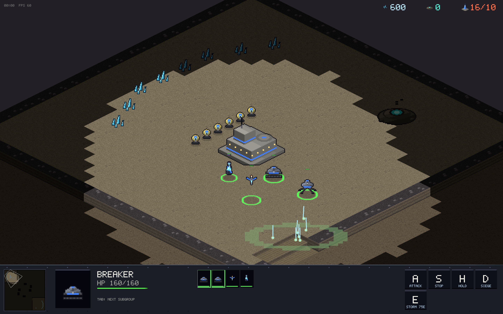

# v0.1.0 — First playable release

The foundation: a complete StarCraft-style 1v1 RTS in Rust with no game
engine, no asset files, and a bit-deterministic simulation.

## Features

- **Deterministic lockstep sim** — Q16.16 fixed-point math, input-only
  mutation, FNV checksums every 24 ticks. Two peers stepping the same
  commands are bit-identical, which is what online play stands on.
- **Two asymmetric races**, authored entirely in data (`units.ron`):
  - *Vanguard Combine* (industrial): Fabricator, Trooper, Vanguard,
    Breaker (siege tank with deploy mode + splash), Skywing (flyer),
    Stormcaller (Plasma Storm caster); HQ, Supply Pylon, Muster Hall,
    Plasma Condenser, Forge, Aerie, Archive (Weapons/Armor research).
  - *Kyth Assembly* (swarm): Drone, Skitter, Spitter, Ravager, Wisp,
    Weaver; Hive, Spire, Sap Well, Warren, Incubator, Roost, Cortex.
- **Full macro loop** — minerals + plasma (gas), tech requirements,
  research, supply, production queues with cancel/refund.
- **One map ("Meridian")** — two high-ground mains, ramps, chokepoints,
  fog of war with the high-ground vision rule (you can't see up cliffs).
- **Skirmish AI** at three difficulties — no cheating, difficulty is
  macro tightness and aggression timing.
- **Online multiplayer** through a Cloudflare Worker relay with 5-letter
  lobby codes; WebSocket lockstep with desync detection.
- **SC-style control**: control groups, shift-queueing, ctrl+click
  type-select, rally points with auto-gather, attack-move, siege toggle,
  spellcasting, rebindable hotkeys, DPI-scaled HUD.
- **Procedural everything** — every sprite (units at 8 facings × 2 walk
  frames × 2 teams), building, cliff face, effect, the 5×7 font, and all
  audio (music loop + SFX) are generated at startup. Zero asset files.

## Platforms

First release with CI-built binaries for macOS (universal), Windows and
Linux, attached to the GitHub release.
