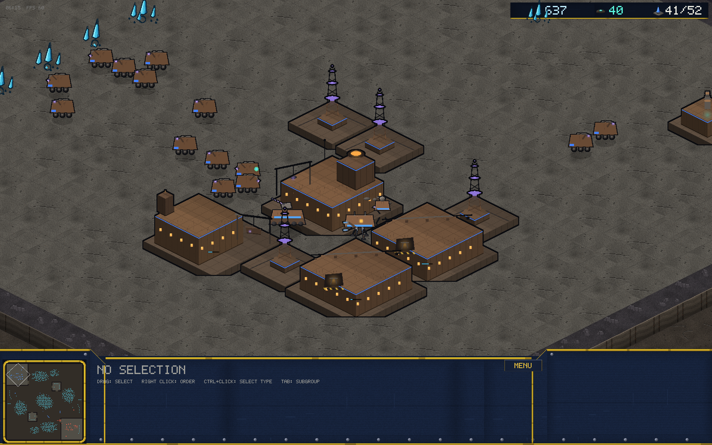
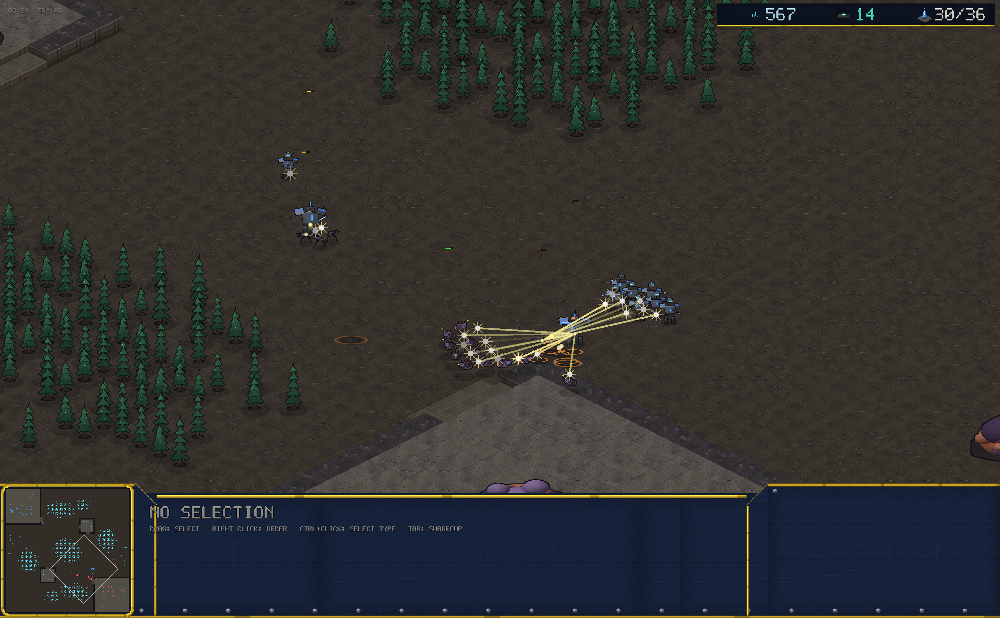
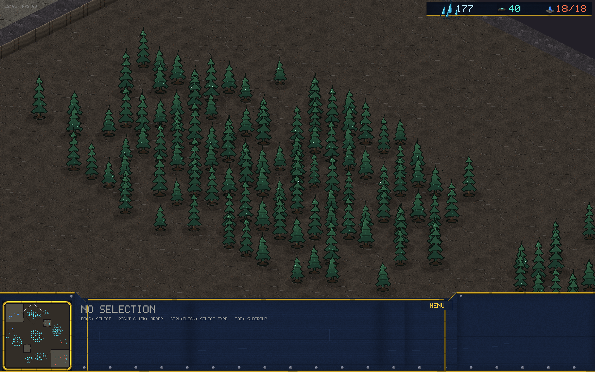
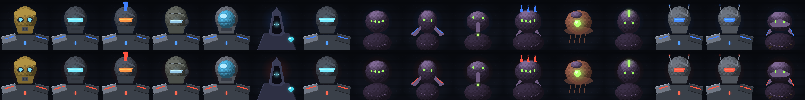
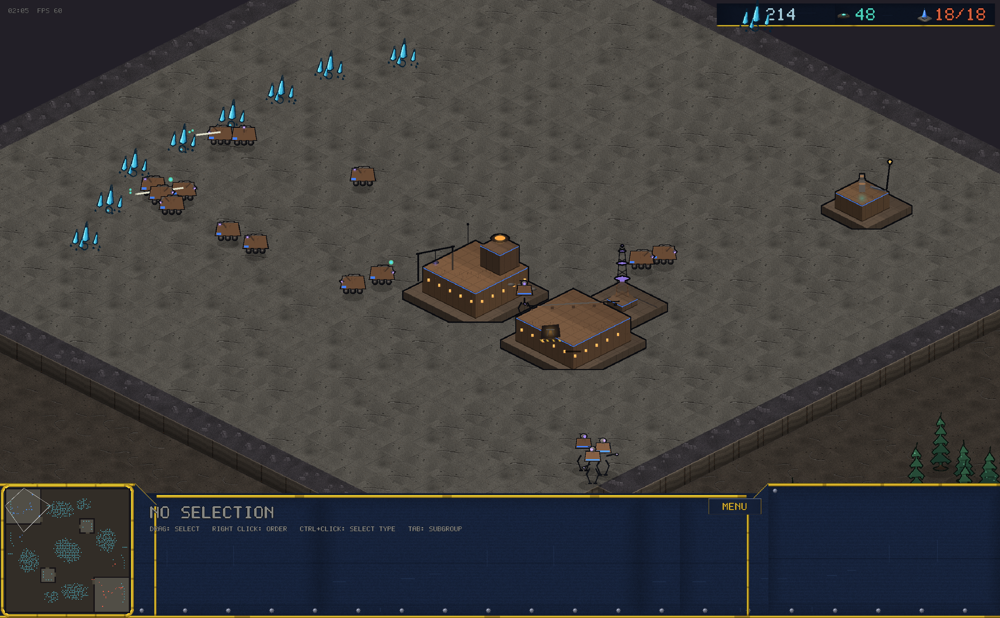
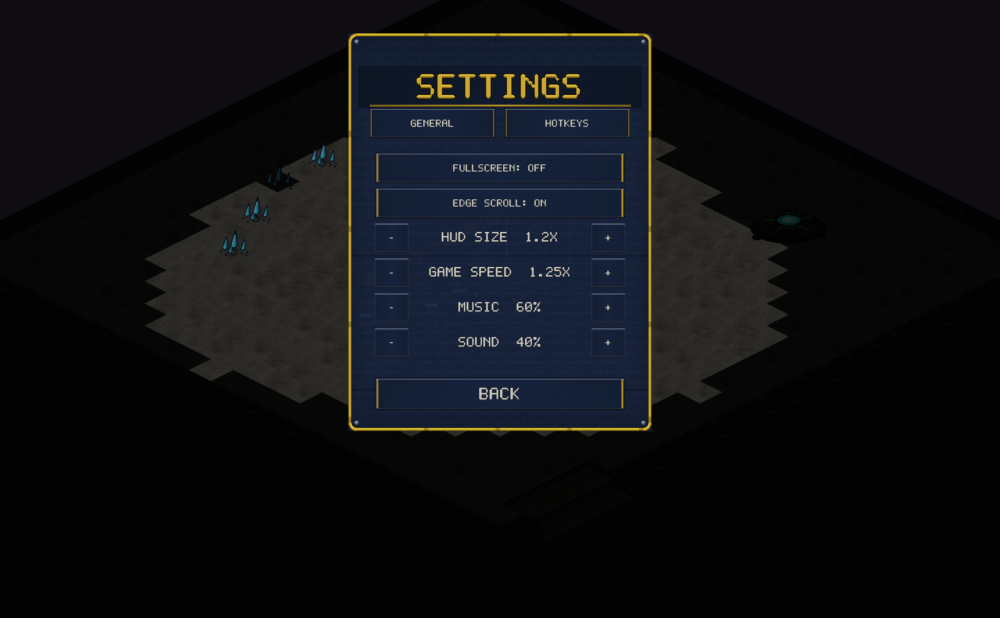

# v0.10.0 — The Ferron Compact

The headline: a **third playable race**, plus a new unit and ability for
each existing race, bust portraits, an audio overhaul, deeper forests
and a round of HUD/menu fixes from playtesting feedback.

## The Ferron Compact (new race)

A salvager machine-cult of rusted iron, magnet-violet coils and amber
furnace light — mechanically a full third faction, and the
capability-driven bot plays it with zero engine changes.

- **Units**: Scrapper (magnet-crane salvage cart, worker), Arclight
  (reverse-knee arc-caster walker, hits air), Mauler (quad wrecking
  walker, mineral-only melee), Lodestone (rail-coil artillery crawler —
  mobile long-range splash, no siege mode), Kestrel (ducted-fan
  gunship), Resonant (coil-priest caster).
- **Buildings**: Bastion foundry-fortress, lattice Capacitor Mast, Fume
  Tap with a burning flare, open-bay Assembly Line, Refit Bay (vehicles
  + upgrades), truss-raised Skydock, Relay coil spire.
- Full 3-race round-robin in the balance and soak harnesses; Elo ladder
  and matchmaking pick the race up automatically.

## A new unit + ability per race

- **Vanguard Bulwark** (Forge): deployable shield projector. While
  deployed it anchors and projects a field — allied units within 4
  tiles take **35% less damage**. Auras don't stack; the field dome is
  visible to both players.
- **Kyth Burrower** (Incubator): heavy-bite ambusher that **burrows**:
  hidden from the enemy, untargetable by direct fire, other units walk
  over it — but it cannot move or attack, and **area damage (siege
  splash, storms) still hits**, so every race has counterplay.
- Both share the transform hotkey with siege mode; the bot's perception
  honors burrow (no cheating wallhacks).

## Presentation

- **Bust portraits**: every unit gets a proper head-and-shoulders
  portrait in the console (per team), replacing scaled-down sprites.
- **Audio overhaul**: layered, filtered synthesis — cracking shots,
  clanging cannons, sub-thump explosions; radio-squelch Vanguard acks,
  formant-warble Kyth voices, struck-metal Ferron rings; and a dark
  64-second ambient bed (drones, wind, a distant knell) replacing the
  old melody loop.
- **Deeper forests**: trees up to ~3 tiles of visual height in four
  variants with per-tree size jitter and canopy shadows — groves now
  layer and occlude like real woods.
- **Bolder font**: the UI font is rebaked with thicker strokes,
  chamfered corners, a lit bevel and a dark outline.

## HUD & menu fixes (from feedback)

- Minimap now fills its console block edge-to-edge.
- Info-panel text no longer clips under the console shoulder.
- Top-bar mineral icon no longer overlaps the mineral count.
- The redundant in-console MENU button is gone (ESC opens the menu).
- Settings split into GENERAL and HOTKEYS tabs — no more off-screen
  options.

## Balance notes

- Arclight 6→7 damage, 50→55 hp, range matched to the Trooper (4.5).
- Mauler loses its gas cost, +5 hp.
- Kyth vs Ferron measures near-even after tuning; VC vs Ferron still
  leans VC — Ferron balance is young and being watched.
- Known: Hard-bot *mirrors* on Thornwood often turtle past the balance
  harness budget; human games and Normal-difficulty games finish fine.
