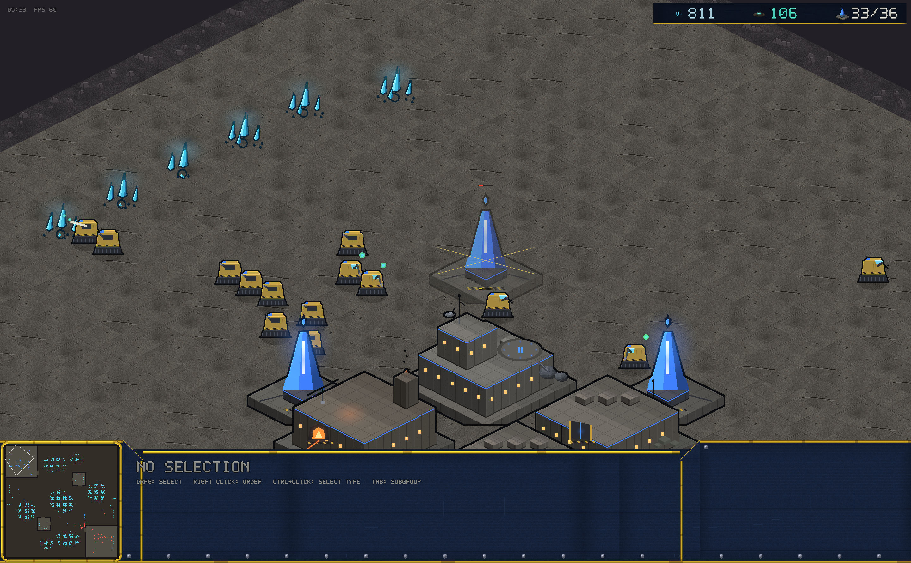
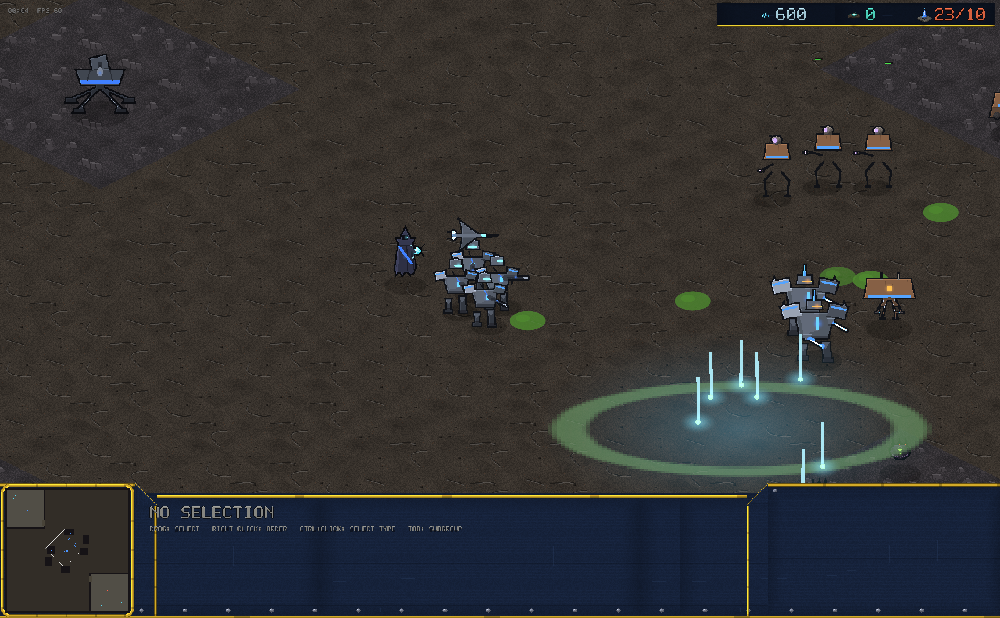
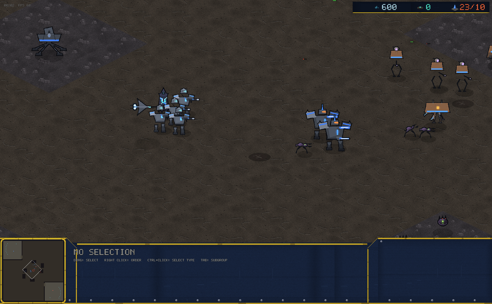
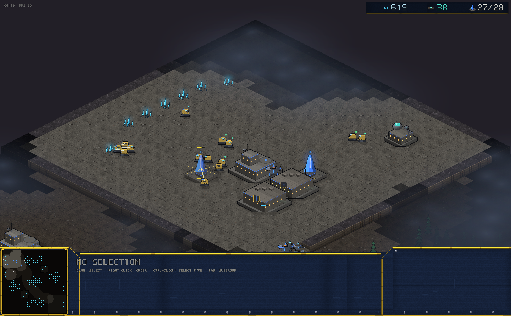
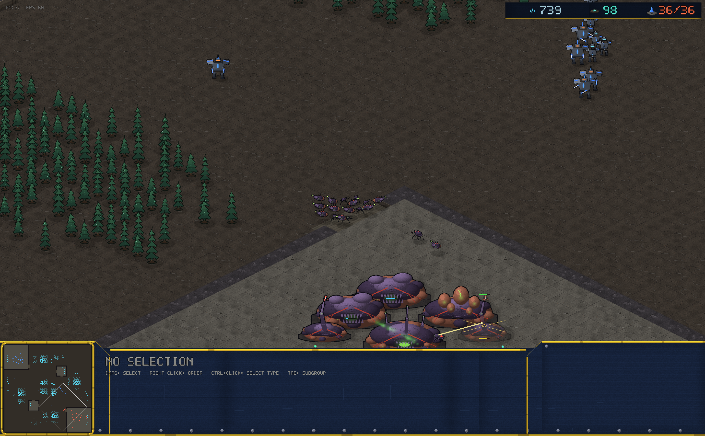

# v0.11.0 — The Juice Pass

No new mechanics — this release is entirely about feel. The goal:
premium, not "sheep".

## Real light

A second render pipeline draws an **additive glow pass** between the
world and the console: light accumulates instead of blending. Mineral
crystals shimmer, geysers breathe teal, pylons and capacitor masts
stand as beacons, furnaces flicker, muzzle flashes and tracers cast
actual light, and Plasma Storms charge the air over a glowing dome
with rising light pillars.

## Every weapon is itself now

Combat effects and sounds key off the attacker: rifle tracers, sweeping
energy-blade and claw slash fans, heavy cannon shells with impact
rings, lobbed acid globs that burst into goo, jagged violet arclight
lightning, streaking rail slugs, thin twin gunship bolts — with new
synthesized fire sounds to match (acid thwip, electric crack, melee
whoosh, rail twang). Workers mining no longer look like troopers
shooting.

## Deaths that mean something

What a thing is made of decides how it dies: machines flash, throw
plate debris, smoke and leave scorch marks; infantry bleed and leave
bodies; Kyth burst into goo puddles. Buildings do all of it at scale.

## Atmosphere

- **The fog of war is actual fog**: two parallax layers of drifting
  haze over unseen ground, denser where unexplored.
- Buildings cast drop shadows; all shadows now match the upper-left
  light.
- The world breathes: geyser vapor, chimney smoke, drifting hive
  spores.

## Tooling

`--stage` arranges a deterministic three-faction brawl with no bot
drivers, so any weapon or death effect can be captured at an exact
tick. Used for every combat screenshot on this page.

(No camera shake. By request.)
