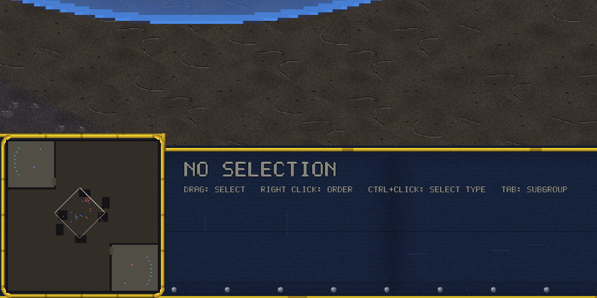

# v0.11.1 — MP responsiveness + UI fixes

## Multiplayer lag fix

Two-machine games were unresponsive and stuttery. Three fixes:

- **Adaptive input delay**: the host measures real round-trip time
  through the session's actual transport (including the relay hop)
  during the handshake and sizes the lockstep pipeline to `rtt + 2`
  ticks (4–12) instead of a fixed 4. A pipeline deeper than the network
  is slow means no per-tick stalls.
- **Stall-flush**: your orders now go out immediately even while the
  sim is waiting on the opponent — they used to sit in a queue until
  the next successful step.
- **TCP_NODELAY on the relay socket**: Nagle's algorithm was batching
  the 24 tiny lockstep frames per second into ~40ms clumps.

Both players must update (the version gate enforces it).

## UI

- The Bulwark shield is now a real translucent 3D dome — fresnel shell,
  hard rim, latitude bands, specular highlight, ground-contact ring.
- The console's left block meets the deck with a clean vertical step;
  the old angled shoulder could collide with the info text on some
  display scales.
- Menu dialog panels now size themselves around their intro copy (the
  multiplayer page cut through its own text), and plain button pages
  no longer reserve a dead headroom zone.

