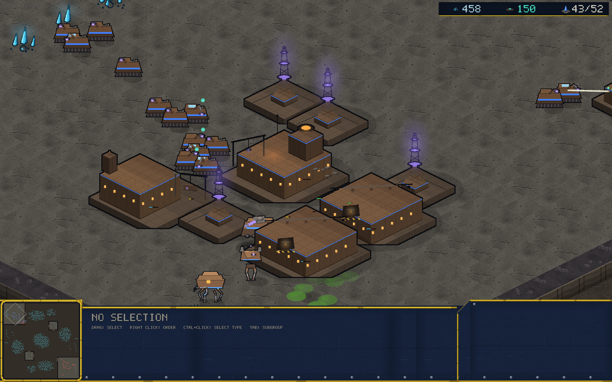
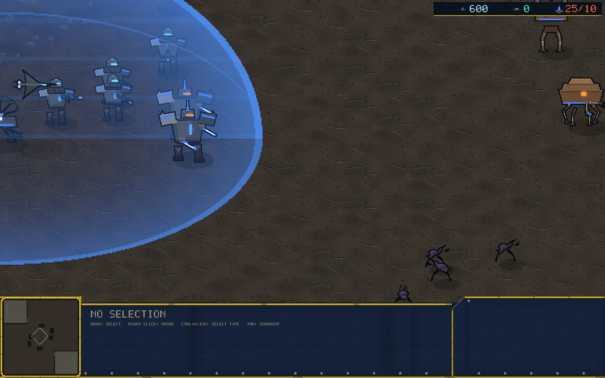

# v0.12.0 — Smarter bots, heavier Ferron, honest netcode numbers

## AI depth pass

- **The bot uses its abilities now**: Bulwarks deploy their shield dome
  when a fight lands within 8 tiles and pack up when the field clears;
  Burrowers holding near home dig in as an ambush screen and surface
  for the bite when something walks onto them (or when the army
  marches).
- **Kiting**: reloading ranged units back off from melee that closes
  inside 1.8 tiles (Hard only).
- **The Thornwood "turtle" stall is dead** — and it was never a turtle.
  Probing showed one side economically dead by minute 13 while its last
  unseen building kept the game alive forever. The bot now runs a
  mop-up sweep (enemy start → every expansion → map corners) when it
  has nothing left on its map. A seed that stalled 22 minutes ends in
  10. Arena A/B: smart 16–10 over legacy (was parity).

## Ferron mass rebuild

The faction read as stick figures and bobby cars. Every unit got
rebuilt around a shared armored-leg kit — thigh quads, lit shin plates,
piston highlights, stomper feet — plus tracked dozer skirts on the
Scrapper, a hip-blocked chicken-walker Arclight, a crab-plated Mauler,
a skirted Lodestone, a fat-shrouded Kestrel and a tiered Resonant.

## Multiplayer diagnostics

The MP HUD shows **PING / PIPE / STALLS** under the clock (orange when
the connection is genuinely bad) — a live RTT probe and stall counter
inside the lockstep. "Feels laggy" is now three numbers you can report.
