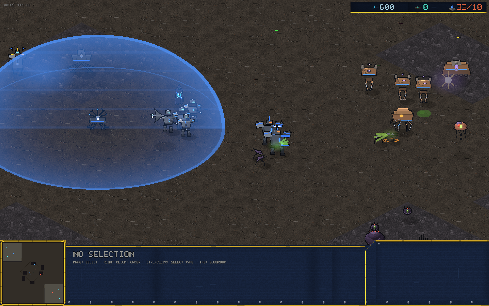
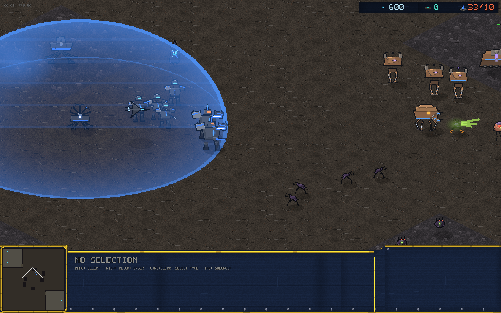

# v0.13.0 — Heroes

One hero per faction: unique (one alive at a time), trained from your
tier-0 hall behind the faction's tech building, 150/100 and 4 supply,
with an energy pool and two abilities on F and G.

- **Marshal Kade** (Vanguard) — caped banner-bearer with a heavy AA
  gun. *Barrage* (F): aimed artillery zone, heavy amber shelling.
  *Overcharge* (G): instant group heal around him.
- **Broodmother Sszrak** (Kyth) — egg-swollen brood queen. *Spawn
  Brood* (F): four broodlings that fight for 15 seconds and dissolve.
  *Corrosive Cloud* (G): aimed lingering acid zone.
- **Magnus Vex** (Ferron) — coil titan with a magnet hammer. *Magnetic
  Well* (F): aimed zone that physically drags ground units toward its
  center — feed it to Lodestone splash. *Overload* (G): instant burn
  around himself.

Zones are aimed with a click (same flow as Plasma Storm) and render
tinted — amber shelling, green acid, violet well with debris spiraling
in. Bots build their hero mid-game and use both ability slots. All of
it is deterministic and checksummed: zone kinds, summon lifetimes, the
well's pull. Five new sim tests pin every ability kind plus hero
uniqueness.

Balance starting point: heroes are strong mid-game spikes, not army
replacements — watch the round-robin as always.
