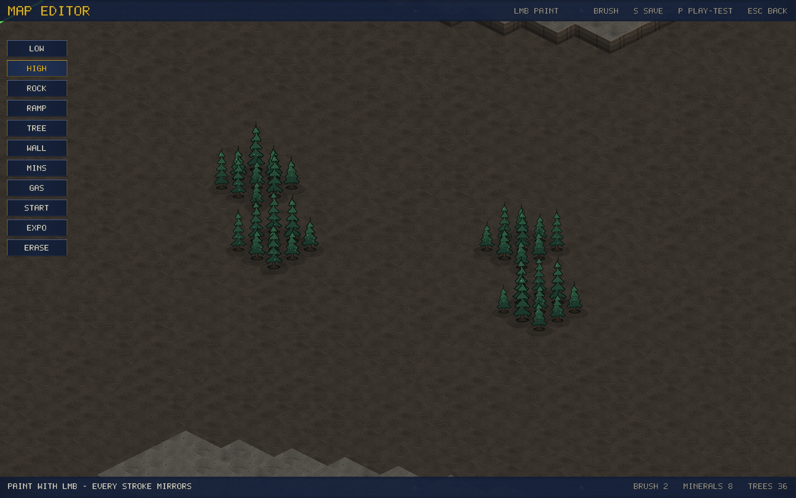

# v0.14.0 — The Map Editor

A visual map editor, in the client, from the main menu.

- **Paint** low/high ground, impassable rock, ramps, destructible trees
  and rock walls, mineral patches, geysers, expansion markers and the
  player starts, with a 1–4 tile brush.
- **Auto-mirroring**: every stroke lands on both halves of the map
  (footprint-aware for geysers and expansion sites), so anything you
  build satisfies the same 180-degree symmetry fairness rule as the
  shipped maps. It is impossible to paint an unfair map.
- **S saves** to `~/.orion-maps/` — saved maps appear in the map picker
  for single-player. **P play-tests** immediately against a Normal bot
  (after a quick validation: starts placed, minerals near them). **ESC**
  autosaves and returns to the menu; your work is restored next time.
- The canvas renders through the real game renderer — what you paint is
  exactly what plays, glow, fog and all.
- Custom maps are single-player for now: creating an online lobby on
  one is refused with a clear message (the joiner wouldn't have the
  file). Map sharing is a natural follow-up.

