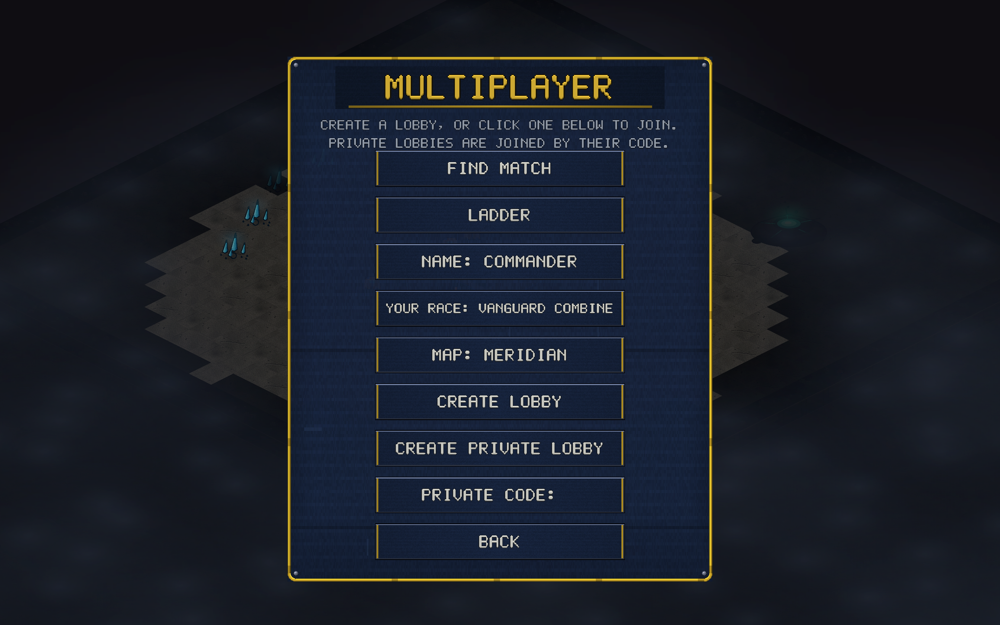

# v0.16.0 — Browser multiplayer

The web demo grew its missing half: **online play now works from the
browser**. A browser player can host or join private code lobbies on the
same live relay the desktop builds use — browser vs desktop cross-play
included, since both sides speak the identical lockstep protocol.

## What's new

- **Browser code lobbies**: CREATE PRIVATE LOBBY / PRIVATE CODE work in
  the web build. The wasm client carries a real WebSocket transport —
  the same newline-framed RON handshake (Hello → Start → Ping/Pong RTT
  probe → Go) the desktop client uses, driven by a 16 ms pump instead of
  blocking threads. The `Lockstep` engine is shared, untouched.
- **Settings persist in the browser** via localStorage — name, race,
  hotkeys and HUD scale survive a reload.
- **Hidden-tab protection**: Chrome fully stops `requestAnimationFrame`
  and clamps timers to ~1 Hz for pages you can't see. Without help, a
  browser player who tabs away would freeze the match for the opponent
  (their half of the lockstep just stops). A background keep-alive now
  nudges the game loop through the winit event-loop proxy while the page
  is hidden, so a backgrounded browser peer degrades to a slow game
  instead of a frozen one — the PING/PIPE/STALLS readout shows it.
- **Version gate works cross-play**: a stale web bundle against a newer
  desktop build gets the same "both players must update" refusal as
  desktop mismatches (confirmed live, by accident).

## Testing / infrastructure

- `--mp-auto` test runs now open a small 480×300 corner window — never
  fullscreen, no audio, no settings writes. (A fullscreen test window
  popping over the desktop gets closed by whoever is at the machine,
  which read as a mystery disconnect in the logs for most of a
  morning.)
- If an automated MP window is closed by hand, the run now says so
  (`mp-auto: window closed by user`) instead of exiting silently.
- Heartbeat diagnostics on both sides: the browser logs pump/game-loop
  health to the console; `--mp-auto` runs print the same to stderr.

## Still desktop-only

Ranked queue, the public lobby browser and replays stay desktop-only for
now — the browser build's next milestones.

## Balance

No balance or sim changes; determinism unaffected.
