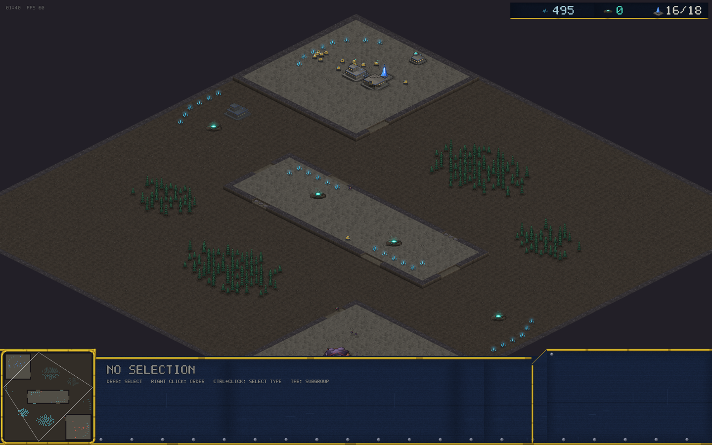
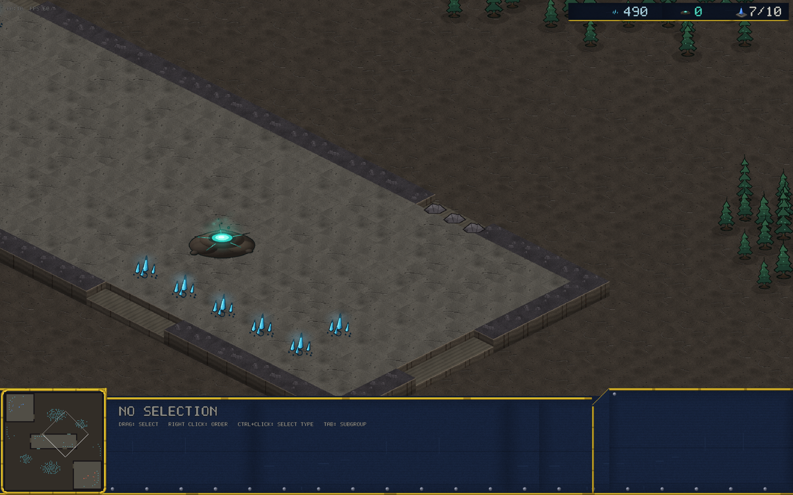
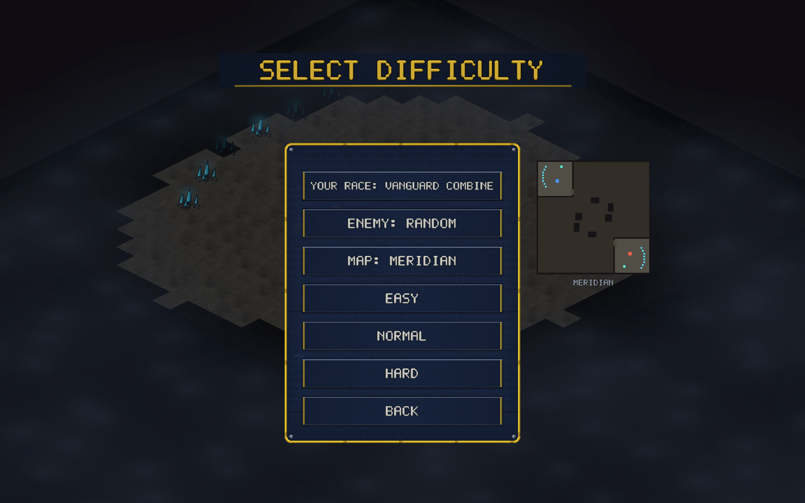

# v0.17.0 — Causeway + map previews

A fourth built-in map, and you can finally see what you're picking.

## Causeway (new map)

88×88. A raised land bridge spans the middle of the map and carries **two
contested expansions** — hold your half of the causeway and you hold the
gas that pays for your third base. Mains sit on NW/SE cliff plateaus with
a single ramp; naturals hug the low west/east walls.

The twist is in the ramps: each causeway third has an **open flank ramp
on one side and a rock-sealed breach ramp on the other**. The side that's
easy for the defender to reinforce is the side the attacker can't use —
until they knock the rocks down and pour in from the blind side.

Wide low-ground flanks circle the whole bridge, dotted with ambush
groves. Siege units parked on the causeway overlook both flanks; flyers
ignore the whole geometry, as always.

Verification: 180°-rotation symmetric (symmetry example), 9-game soak
slice clean — zero invariant violations, determinism shadows clean, and
fewer bot stalls than caverns or thornwood. Hard-bot balance round on
causeway shows no meaningful spawn-side bias in mirrors; the known
VC-over-Ferron lean shows up here too and stays on the watch list as a
race-balance item, not a map item.

## Map previews in the pickers

The MAP row in the single-player and multiplayer menus now shows a live
terrain thumbnail beside the panel — minimap palette, mineral/geyser
dots, start markers — for built-in *and* custom (editor-made) maps. No
more picking blind.

## Balance

No unit or economy numbers changed. Causeway's economy: mains 1250/patch,
naturals and causeway thirds 1000/patch, all geysers 2500.
