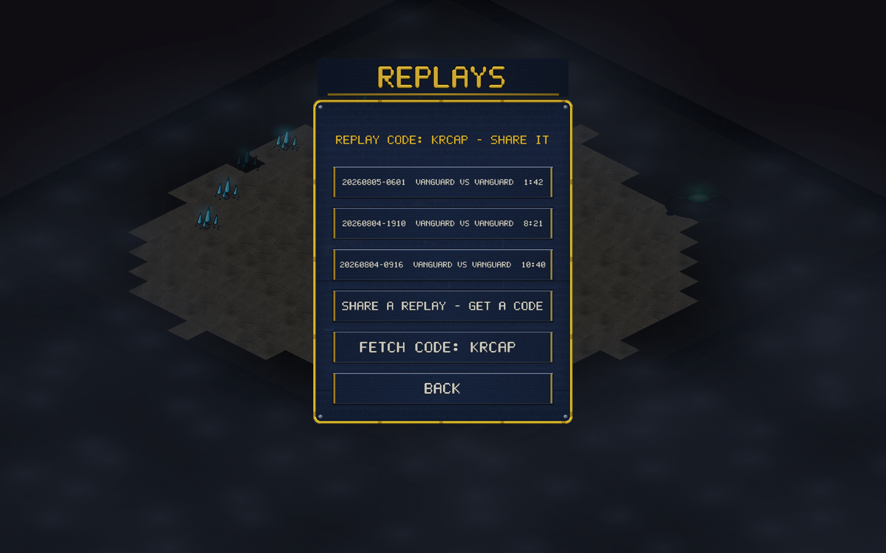

# v0.18.0 — Replay sharing by code

Replays could already be saved and rewatched (since v0.3.0) — now they
travel. Share one and you get a 5-letter code; anyone can type that code
into their REPLAYS page and the game lands in their list, ready to
watch.

## How it works

- **SHARE A REPLAY — GET A CODE** arms share mode: click any replay in
  the list and it uploads to the relay, which answers with a code shown
  at the top of the page.
- **FETCH CODE:** type a code (Enter or click) and the shared replay
  downloads straight into your list as `shared-<CODE>`.
- Codes use an unambiguous alphabet (no I or O). Shared replays live on
  the relay for 30 days, capped at 120 KB per replay and 300 replays
  total (oldest evicted) — a courtesy locker, not an archive.
- The transport is the same Cloudflare relay that runs lobbies and
  ranked play; a new `Vault` Durable Object stores the files, behind
  the same per-IP rate limits as the lobby list.
- Desktop builds only for now — the web demo hides the rows.

## Verification

Live end-to-end on the deployed relay: a 63 KB replay uploads, comes
back bit-identical by code, bad codes 404, junk uploads are rejected,
and oversized uploads are refused. Full test suite, smoke and scripted
game stay green.

## Balance

No gameplay changes.
