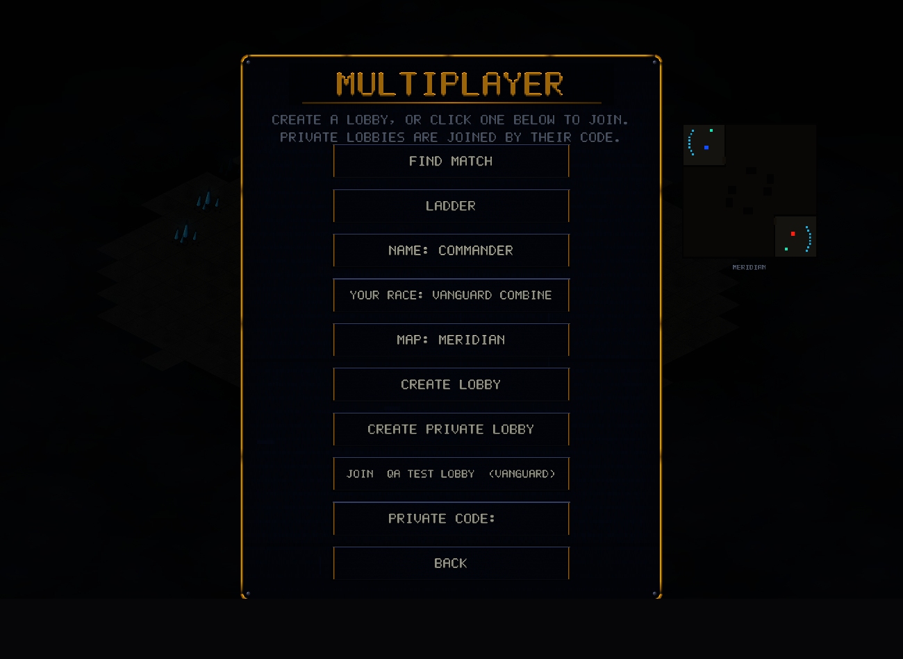

# v0.19.0 — The browser build joins the lobby list

The web demo can now see and join **public lobbies** — the same live
list desktop players use. Until now a browser player could only join by
private code; now the MULTIPLAYER page fills with click-to-join rows,
polled from the relay every 3 seconds.

*That screenshot is a fully headless Chrome running the game on WebGPU —
the JOIN row is a real lobby hosted by a desktop client at capture
time.*

## What changed

- `relay_wasm` grew a real lobby-list fetch (browser `fetch` → JSON →
  the same channel shape the native thread version uses), and the
  relay's JSON endpoints now answer with CORS `allow-origin: *` so
  browser pages may read them.
- Joining a listed lobby reuses the proven WebSocket session path from
  v0.16.0's code lobbies.
- A backgrounded multiplayer page keeps its list fresh through the
  hidden-tab keep-alive, so it isn't stale the moment you tab back.
- Testability: `?page=mp` (also `replays`, `difficulty`) boots the web
  build straight into that menu page. Combined with headless Chrome's
  WebGPU support this gives one-command screenshot verification of web
  UI — it's how the CORS gap was found and confirmed against the live
  relay.

Ranked queue and replay sharing remain desktop-only.

## Balance

No gameplay changes.
