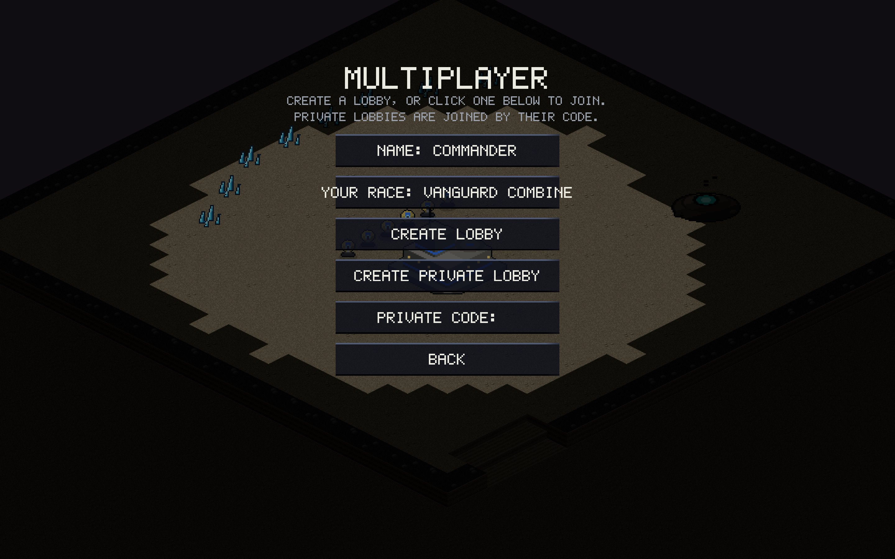
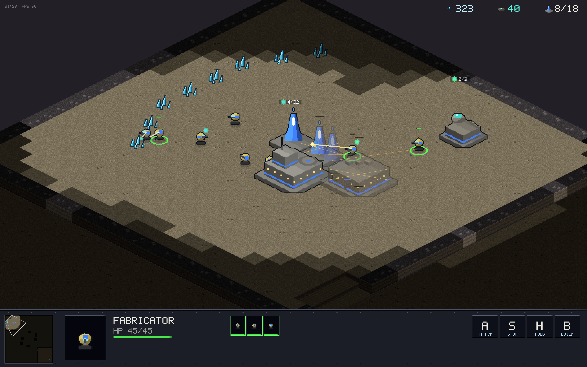

# v0.2.0 — IP-free multiplayer & double-click installs

Multiplayer stopped feeling like 1998: no IP addresses anywhere, and the
release artifacts became genuinely double-clickable on every platform.

## New

- **Lobby browser** — CREATE LOBBY lists your game publicly (player name
  + race); anyone clicks to join. A Directory Durable Object on the relay
  tracks open lobbies and unlists them the moment someone joins.
- **Private lobbies** — CREATE PRIVATE LOBBY gives a 5-letter code that
  doubles as the password. The code is the only thing players ever see;
  the old direct-TCP/IP path was deleted outright.
- **Double-click releases** — macOS gets a real `Orion.app` (universal
  arm64+x86_64 binary, app icon, ad-hoc signed so Apple Silicon launches
  it); Windows a zipped `orion.exe`; Linux a tarball. The install table
  in the README covers all three.

## Improved

- **Multi-worker build queueing** — placing several buildings with
  several workers selected spreads the jobs: 5 workers + 3 placements =
  3 peel off, 2 keep mining. Previously one worker got the whole list.

- **Worker visual feedback** — order-queue lines show each selected
  worker's plan (amber to build sites, blue to gather targets), mining
  shows chip sparks and a pick beam, construction shows weld arcs,
  carried cargo bobs visibly, and saturation labels over bases and
  extractors read `workers/cap`.
- **Rally on constructing buildings** — worked in the sim, was never
  drawn; the rally line now shows immediately.
- Relay hardening: rate limits, directory caps, per-connection frame
  budgets.
