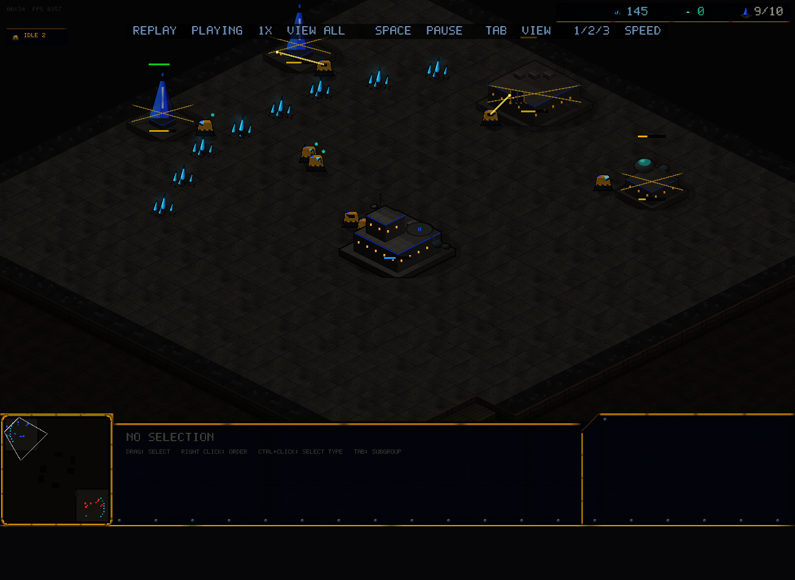
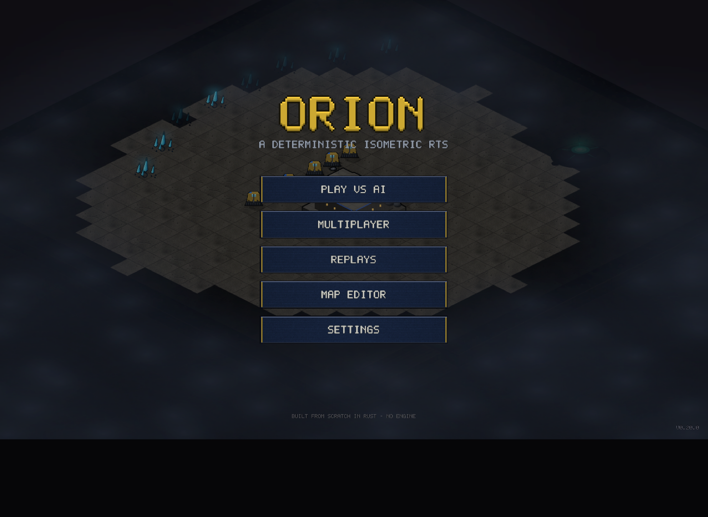

# v0.20.0 — Replay links: watch shared games in the browser

v0.18.0 made replays shareable by code; now the code is all anyone
needs. The web build's FETCH CODE row downloads a shared replay from
the relay vault and plays it on the spot — no files, no install. Even
better, replays are now **linkable**:

    https://<demo-host>/index.html?replay=KRCAP

opens the demo and plays that shared game directly.

*This capture is a fully headless Chrome given only a `?replay=` URL:
it fetched the replay from the live vault and rendered playback,
controls and all.*

## What changed

- `start_replay` split into a file loader (desktop) and an in-memory
  starter — the browser feeds fetched RON straight into playback.
- The FETCH CODE row now appears in the web build's REPLAYS page;
  SHARE stays desktop-only (uploading needs local files).
- `?replay=CODE` boots straight into playback of a shared replay.
- The vault's GET responses carry CORS headers so browser pages can
  read them.

## Balance

No gameplay changes.

## v0.20.1 — browser playtest fixes

Five reports from the first real two-player browser session, all fixed:

- **It was far too dark**: WebGPU canvases only accept non-sRGB surface
  formats, so the renderer's linear output was displayed raw. Frames now
  render through an sRGB *view* format — the browser finally matches the
  desktop look (screenshot above is the fixed web build).
- **"It crashed when my opponent left"**: it actually froze — the wasm
  transport's leaked pump closure kept channel ends alive, so the
  lockstep never learned the peer was gone and waited forever. Session
  shutdown now drops the channels; you get the OPPONENT DISCONNECTED
  banner and can leave to the menu. Reproduced and verified with a
  headless-Chrome match whose opponent quits at tick 240.
- **No sound**: the web build never had an audio backend. It does now
  (WebAudio), initialized on your first click — browsers refuse audio
  before a user gesture.
- **FIND MATCH did nothing**: ranked needs the desktop build; the web
  build now says so instead of dangling a dead button.
- **QUIT froze the tab**: there is no process to quit in a browser —
  the button is hidden on the web.

Also new: `?host=CODE` / `?join=CODE` URL hooks, so a headless browser
can play real relay matches — that's the harness that caught the
disconnect bug.
