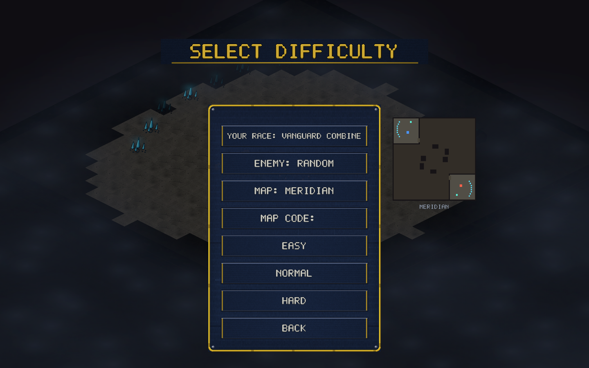

# v0.21.0 — Custom maps online + map sharing by code

The map editor stops being a single-player toy. Two changes, one theme:
maps made in the editor now travel.

## Custom maps in multiplayer

Host a lobby on any editor-made map — the joiner needs nothing. The map
itself rides inside the match handshake, so the other player (desktop
**or browser**) receives it in-band and both sides simulate the exact
same terrain. No downloads, no version drift: verified end-to-end on
the live relay with a native host and a headless-browser joiner playing
240 lockstep ticks on a custom map with matching checksums.

## Share maps with a 5-letter code

- In the **editor**, press **U** to upload your map — you get a code
  like `PNKLJ` in the status line.
- On the **PLAY VS AI page**, type a code into the MAP CODE row — the
  map lands in `~/.orion-maps`, appears in the picker (with its terrain
  preview), and is selected for the next game. From there it hosts
  online like any other map.

Shared maps live in the same relay locker as shared replays: 120 KB
cap, 300 entries, 30-day shelf life.

## Under the hood

The relay's per-message cap rose from 16 KB to 160 KB so the handshake
frame can carry a map; abuse is still bounded by the per-connection
byte budget and rate limits. A new `dumpmap` example serializes builtin
maps as fixtures for testing the pipeline.

## Balance

No gameplay changes.
