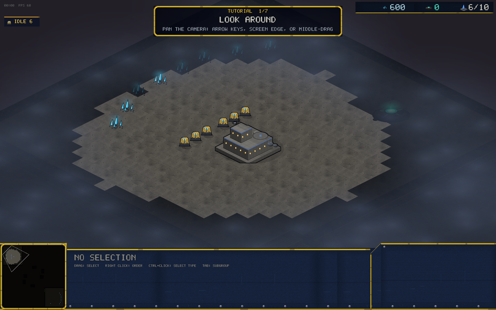

# v0.22.0 — The tutorial

With the repo public and the game playable in a browser tab, strangers
now land in Orion with zero context. The new **TUTORIAL** (top of the
main menu, browser build included) turns that first five minutes into a
guided game.

## How it plays

Seven objectives, one at a time, in a gold-framed panel that stays out
of the way:

1. **Look around** — pan the camera
2. **Select your Fabricators** — box-select the workers
3. **Put them to work** — right-click the crystals
4. **Build a Supply Pylon** — the build grid (B, then Q)
5. **Build a Muster Hall** — army production
6. **Train 4 Troopers** — queueing
7. **Destroy the outpost** — attack-move into a small Kyth camp mid-map

Completions chime and flash; razing the outpost triggers the normal
victory screen. There is no fail state — no bot thinks during the
tutorial, and the two Skitters guarding the camp only fight back.

## Why it's built this way

The tutorial is a thin objectives layer over a completely normal
single-player game — same sim, same commands, same HUD. Nothing is
simulated differently, so every habit learned transfers 1:1 to
skirmish and multiplayer. Practice runs don't record replays.

Objective predicates are unit-tested against the real sim (including
the subtlety that mineral patches have limited mining slots).

## Balance

No gameplay changes.
