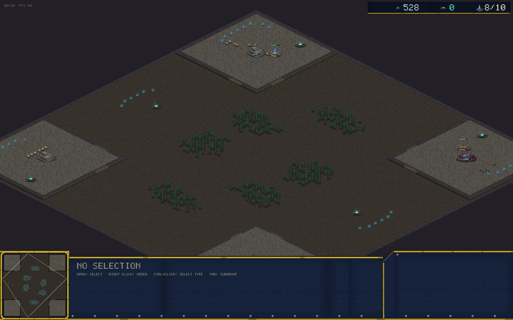

# v0.24.0 — 2v2

Team games. The biggest multiplayer feature since ranked, built in
three verified layers.

## Playing it

**CREATE 2V2 ROOM** on the multiplayer page gives you a 5-letter code
for a four-seat room; the match auto-starts the moment it fills. Teams
are seat pairs: the host and the first joiner against the other two.
Joining needs nothing new — type any code into PRIVATE CODE and the
game detects whether it's a duel or a room.

**Crossfire** is the 2v2 map: four corner mains where allies share a
side of the map, mirrored contested expansions on the flanks, and
ambush groves shaping the open center. The two teams occupy exactly
mirrored ground (the symmetry checker now validates team maps).
Editor-made 4-start maps work in rooms too — the map still travels
inside the handshake.

Teammates share vision, can't be hit by your auto-attacks, benefit
from your shield auras and heals, and share your team's color. Victory
is by team: the game ends when one side has no standing players.

## Under the hood

- The relay's lobby became a slotted room (host + up to three seats,
  broadcast forwarding, seat assignment by control frame). 1v1 lobbies
  are byte-identical to before.
- The lockstep driver now runs N tagged command streams and steps only
  when every seat's tick has arrived; the host sizes the shared input
  delay to the WORST seat's measured RTT.
- Verified end to end: four processes through the live relay on
  crossfire — 240 lockstep ticks, matched checksums on every seat.
  Plus a four-peer in-process lockstep test and three team-mechanics
  tests in the sim suite.

Not yet: public room listing, ranked 2v2, browser-side room joins,
bots filling empty seats, room replays.

## Balance

No unit numbers changed.
