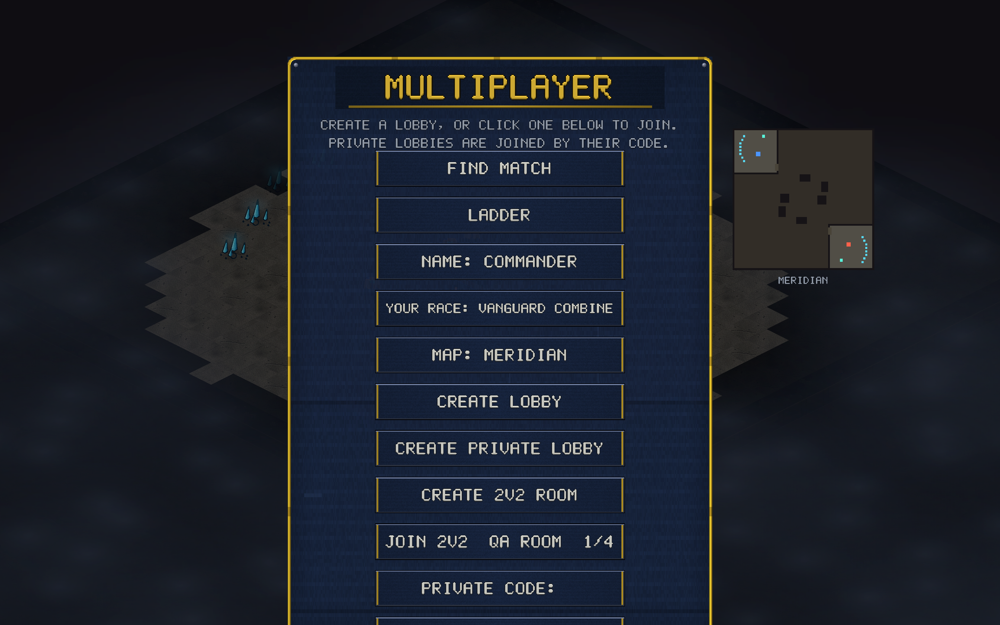
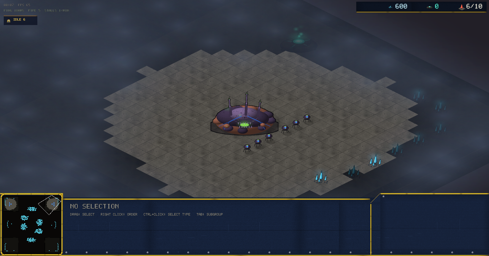

# v0.25.0 — 2v2 everywhere

The polish pass on team games: everything v0.24.0 said "not yet" about
2v2, except ranked. Rooms are now listed publicly, start on demand with
bot fill, record replays, and can be joined from the browser.

## Bots fill empty seats

The room waiting page has a new row: **START NOW — BOTS FILL EMPTY
SEATS**. Two friends no longer need two more friends — start with any
number of humans and Hard bots take the remaining seats.

Under the hood the host drives the bot brains and feeds their commands
through the exact same lockstep channel as its own input, so joiners
need zero new code — a bot seat looks like any other player's tagged
command stream. Which seats are bots rides in the start handshake, and
bot races are dealt from the match seed.

## Public rooms in the lobby browser

CREATE 2V2 ROOM now lists your room publicly (same as duel lobbies —
private rooms by code still work). Rooms appear as
`JOIN 2V2  <name>  1/4` with a **live fill count**: the relay
re-announces the room as seats fill and delists it when it's full or
anyone leaves. One click seats you.

## Browser room joins

The web build speaks the room handshake. Type a room code (or click a
listed room) in the browser and you're seated — the join path
auto-detects duel vs room from the relay's seat frame, identically on
desktop and web. Custom 4-start maps work too: the map itself travels
inside the handshake, so the browser needs no file.

Hosting rooms stays desktop-only for now (the host runs the fill bots).

## Room replays

Replays now record **teams**, and games on custom maps embed **the map
itself** in the replay file — so a 2v2 on an editor-made map plays back
anywhere, shared with anyone. Room games record automatically, like
every other match. Old replay files load unchanged.

## Under the hood

- The wasm relay pump gained the room phases (seat frame → Hello2 →
  Start2 → Go), sharing the native handshake's shape; the duel path is
  untouched.
- The relay directory upserts a room's entry on every join until it
  fills, keeping `filled/slots` live in `/lobbies`.
- A new sim test replays a 2v2 on an embedded custom map and asserts
  the resimulated checksum matches the live game bit-for-bit.
- Verified end to end: a native host + headless-Chrome joiner played
  Crossfire in lockstep past tick 240 with two host-driven bots, no
  desync — and the protocol version gate correctly refused a stale
  0.24.0 web build during testing.

## Balance

No unit numbers changed.
