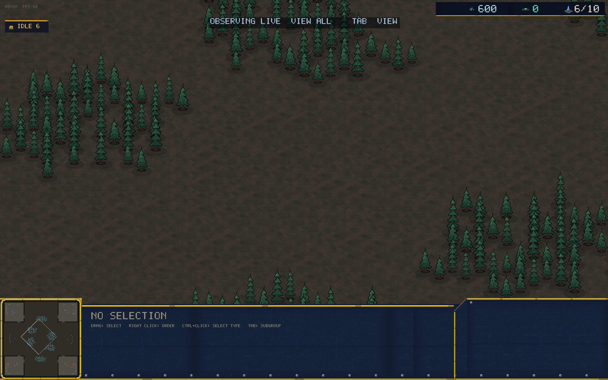

# v0.26.0 — Observer mode

Watch live matches. Any lobby or 2v2 room can now be observed through
the relay — silently, from the outside, with the full picture.

## Watching a match

Type a code on the multiplayer page and pick **WATCH THIS CODE**
(shown under PRIVATE CODE). You'll drop into the match the moment it
starts: map revealed, free camera, no seat of your own. **TAB** cycles
the fog perspective — each player's own view, then ALL. Works for
duels and 2v2 rooms alike, custom maps included; up to eight observers
per match.

Observers are invisible to the players: they receive the game but send
nothing, and joining or leaving mid-match disturbs no one.

## How it works

- The relay gained a third role: `obs` connections tap the room's
  broadcast without taking a seat. The match tears them down when it
  ends.
- The observer client never handshakes — it watches the players'
  handshake fly by (Start/Start2, then Go) and builds the same
  deterministic sim from their tagged command streams, stepping each
  tick as soon as every seat's commands have arrived.
- Trust, but verify: the players exchange periodic state checksums;
  the observer checks its own sim against them, so a diverged view is
  flagged (OBSERVER DESYNC) instead of silently lying.
- Replay fog cycling is now sized to the player count, so 4-player
  room replays (new in v0.25.0) cycle all four perspectives too.
- E2E-verified live: a duel and a bot-filled Crossfire room were both
  observed past tick 190 with checksums matching (`--mp-auto obs:CODE`,
  plus `ORION_OBS_SHOT` for visual proof).

Observing is desktop-only for now — the browser client doesn't speak
the passive handshake yet.

## Balance

No unit numbers changed.
