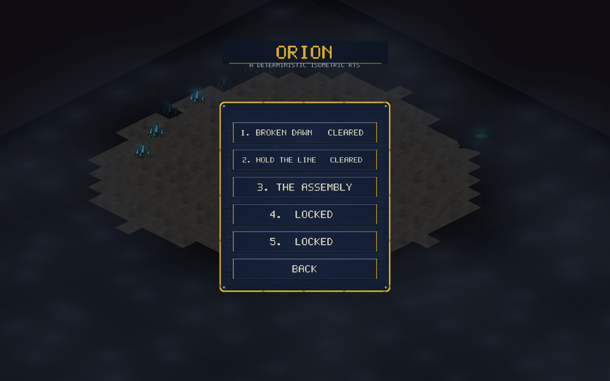
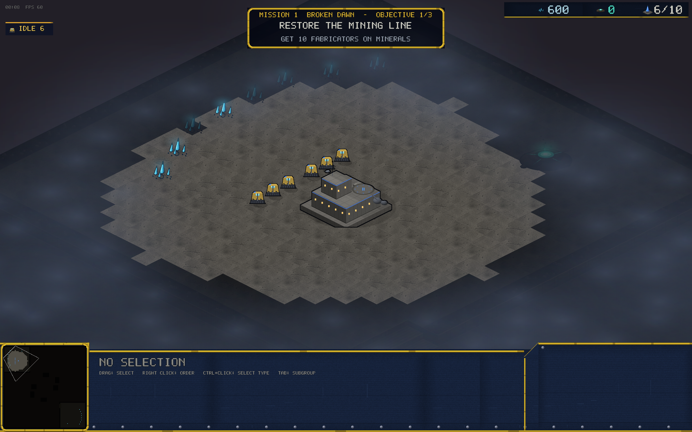

# v0.27.0 — The campaign

Five scripted missions, a story to play through, and a measured trim to
the Vanguard's edge.

## The mini-campaign

**CAMPAIGN** on the main menu. Five missions, unlocked in order,
progress saved between sessions:

1. **BROKEN DAWN** — rebuild a broken mining line on Meridian and burn
   out a Kyth warren camp, under scripted skitter raids timed to hit
   while you're mustering.
2. **HOLD THE LINE** — the Ferron Compact comes for the Causeway with a
   war chest. Keep your headquarters standing for eight minutes; the
   objective panel counts down live.
3. **THE ASSEMBLY** — play as the Kyth for the first time. Swarm cheap,
   swarm fast.
4. **IRON COMPACT** — play as the Ferron on Thornwood: arclight lines,
   high ground, trees in the sightlines.
5. **MERIDIAN'S END** — the finale on Crossfire: a 2v2 with an allied
   commander at your side and Marshal Kade at the front.

Missions are built on the tutorial's machinery: objectives are drawn in
a gold mission panel, raids arrive through the same command channel as
everything else, and the other seats are driven by real bots — the same
brains you skirmish against, at mission-tuned difficulties. Mission
replays are off (scripted events aren't part of a command stream).

For the beaten path there's a headless QA harness too: `--mission-auto
K` plays mission K with a Hard bot standing in for you — missions 1–4
all resolve in victory; the finale's bot-vs-bot stand-in stalemates
(three Normal bots counter-punch each other forever), which is exactly
the hole Marshal Kade and a human plan are for.

## Balance

**Trooper cooldown 0.86s → 0.90s** (−4.4% sustained damage).

The measured story (all Hard, 8 seeds per matchup, meridian): VC took
the cross-race total 23–15–10, beating Kyth 13–3 and Ferron 10–6 — and
the combat lab (new VC-vs-Kyth and Ferron-vs-Kyth fixtures in
`combat_lab`) shows cost-matched Kyth ground cores getting wiped by
trooper lines even with the lab's first-mover advantage. The trooper is
the one unit in every VC composition, so it takes the trim; Kyth and
Ferron numbers are untouched (Kyth already beats Ferron 12–4 there —
a Kyth buff would have widened that).

After the change (same seeds): total **20–16–10**, VC-vs-Kyth 12–4,
VC-vs-Ferron 8–6. A modest shave, which is the intent — 8-seed sweeps
are noisy and this number is the one in every VC composition. VC still
leads against Kyth on meridian; that gap stays on the watchlist rather
than getting a second speculative change stacked on top.

One-line revert if it plays badly: trooper `cooldown_s: 0.90 → 0.86`.

## Also in this release

- The mirror-covariance probe (`examples/mirror.rs`) now takes a map
  name. Pointed at Caverns it found a real seat bias (P1 wins mirror
  matches ~8-0): a non-mirror-covariant tie-break when two units land
  exactly coincident. Filed for the next patch — Caverns ladder games
  are affected today.
- Room-host handshake code cleanup (no behavior change).
