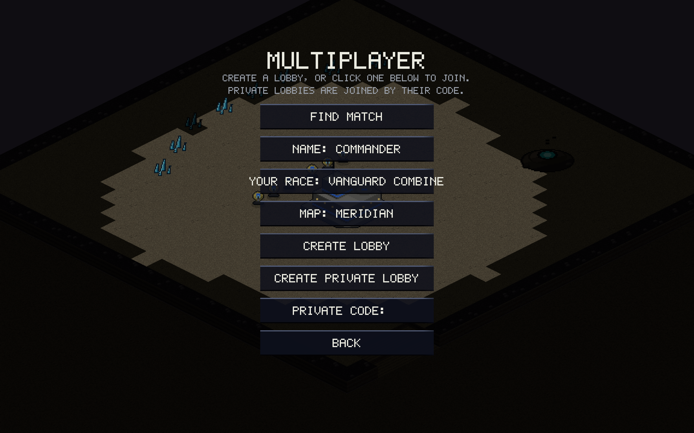
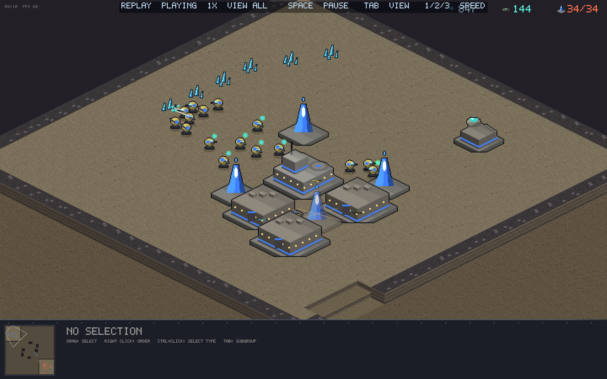
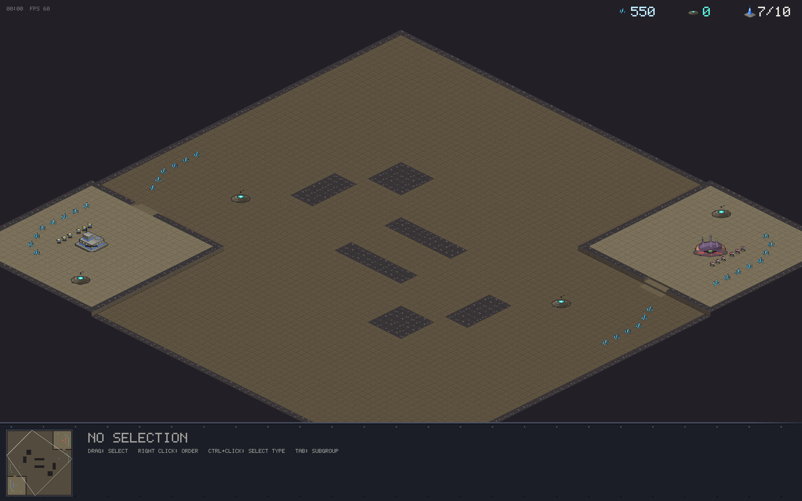

# v0.3.0 — Ranked matchmaking, replays, Caverns

The competitive release: press FIND MATCH and the matchmaker pairs you by
skill *and* latency; every game becomes a rewatchable replay; and a second
map brings expansions into the game.

## Ranked matchmaking

- One button: pick your race, **FIND MATCH**. The matchmaker (a Durable
  Object on the relay) pairs players whose **Elo gap** and **combined
  latency** both fit — and both windows widen the longer you wait, so
  close matches happen fast and *a* match always happens.
- Latency is real, not guessed: the client probes its RTT to the relay
  edge, and cross-continent pairs get a penalty.
- Ratings are Elo (K=32, start 1200) keyed to an anonymous ID generated
  on first launch — no accounts. Your MMR shows on the button and on the
  end-of-match screen.
- Both players report the result; agreement updates ratings, a rage-quit
  resolves against the quitter on a timeout, and quitting a ranked game
  is a forfeit. **No bots in the queue** — every entry is a live human.
- Ranked games are played on a random map from the pool.

## Replays

- Every game (vs AI or online) auto-saves to `~/.orion-replays/` — a
  replay is just the seed + command stream, a few hundred KB at most,
  and reproduces the game bit-exactly.
- The main menu gained **REPLAYS**: recent games listed by date, matchup
  and length. Watching gives pause (SPACE), speed (1/2/3 = 1×/2×/4×),
  fog perspective per player or reveal-all (TAB), free camera, and a
  neutral "NAME WINS" banner.
- Determinism is enforced by test: a recorded game re-simulated from its
  file must land on the identical checksum.

## New map: Caverns

- An homage to SC2's **Xel'Naga Caverns**: NE/SW high-ground mains, a
  **natural expansion** below each ramp with its own mineral line and
  geyser (first map with expansions), and cavern rock formations that
  split the center into a tight middle lane and two wide edge routes.
- Bots understand expansions: they take their natural at ~13 workers.
- Map select on both the vs-AI and multiplayer pages; the host's choice
  travels in the match handshake.

## Bots got teeth

- **Siege micro**: Breakers deploy inside working range and pack up when
  the field clears.
- **Storm micro**: casters storm the biggest visible enemy clump (3+
  units), avoid friendly fire, and never stack storms. Fog-honest — the
  bot only reacts to what its player can actually see.
- **Scouting**: a worker pokes the enemy main around 1:20.
- Decisive endgames: maps mine out around minute 15 and the bots go
  permanently aggressive at 13, all-in at 16 — turtle stalemates ended.

## Balance & fairness

- **Plasma Storm nerfed**: 100 energy (was 75), 48 total damage over 8
  pulses (was 72 over 9), and overlapping storms **no longer stack** —
  the stacked version deleted whole armies with no counterplay.
- **Spawn fairness overhaul**: a mirror-covariance probe proved the two
  spawns weren't playing the same game — fixed-point multiply rounded
  toward the northwest, flow-field tie-breaks preferred the northwest,
  the starting worker arc wasn't point-symmetric, and building-spiral
  mirroring was off by a footprint. All fixed; the Kyth mirror went from
  0–7 for the SE spawn to even, verified by swapping spawns.
- Gather traffic robustness: approach fields now seed from every open
  tile around a destination, so a walled-in base can't strand its
  workers (found by the soak harness as a full economy freeze).

## Under the hood

- Meridian mineral patches: 1500 → 1000 (mines out by ~15:00 by design).
- The QA soak alternates both maps; map symmetry is audited by a
  dedicated example across terrain, elevation, resources, expansions and
  starts.
