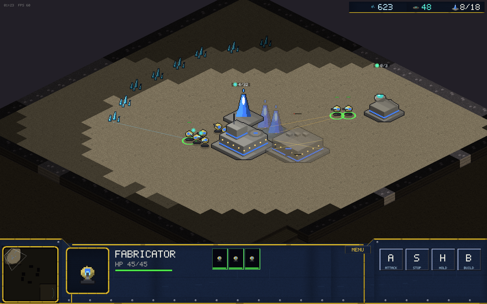
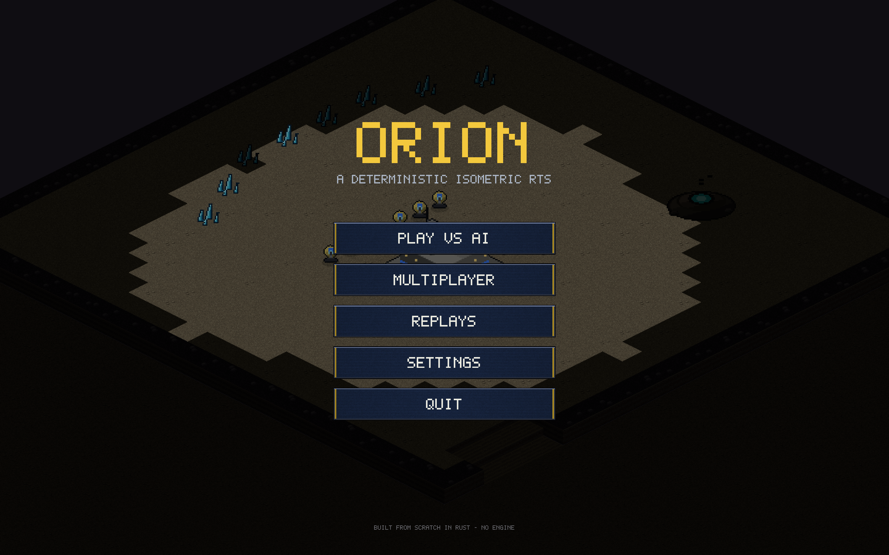
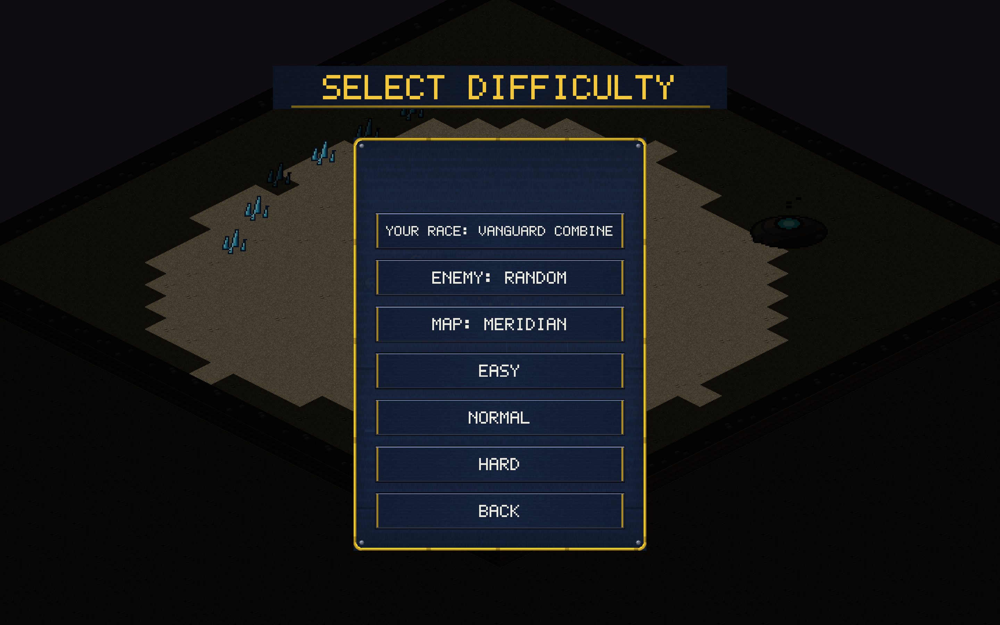
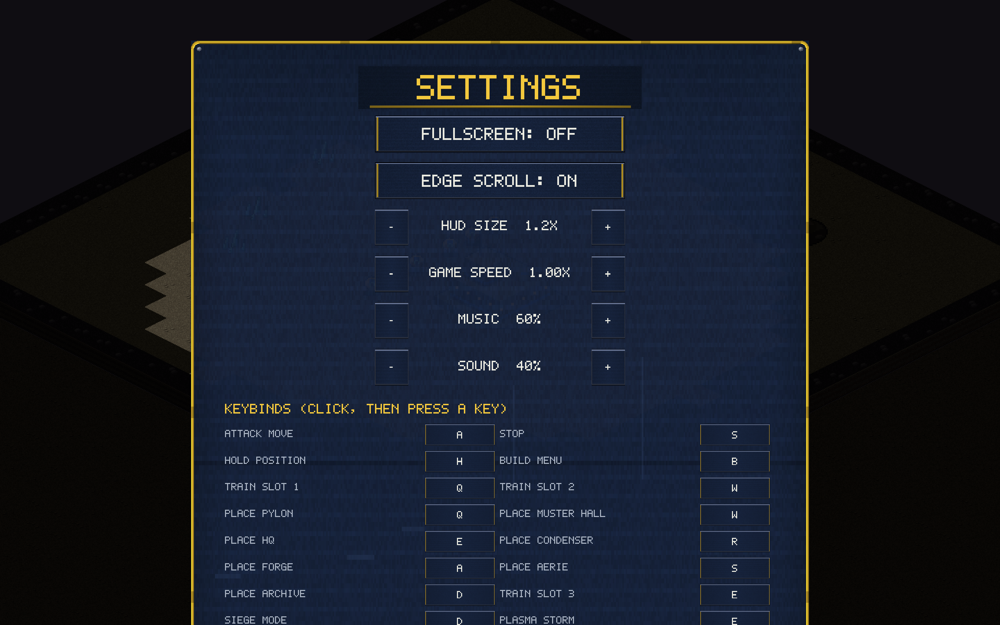

# v0.4.0 / v0.4.1 — The console rework

*(v0.4.1 is the fixed build: the circuit-trace detailing on the first
pass read as broken pixels at dialog scale and a long race label could
overflow its plate — both patched, and the console got taller with a
bigger portrait and larger type. Screenshots below show v0.4.1.)*

The whole interface got the StarCraft: Remastered treatment: a proper
command console instead of a flat bar, and menus that match it. Still
100% procedural — every panel texture, gold strip and beveled button is
painted into the sprite atlas at startup; the game ships zero asset files.

## The console

- **Navy tech panels** with brushed texture and animated-looking circuit
  traces, tiled at native scale across the deck.
- **Gold piping** along every edge with rounded corners, riveted seams,
  and angled shoulders where the raised minimap and command-card blocks
  step down to the center deck.
- **Framed minimap and portrait** — gold frames around dark insets.
- **Beveled command-card buttons** with distinct hover states and gold
  hotkey badges.
- **MENU button in the console** (opens the pause menu), SC-style.
- The resource readout sits on its own framed plate top-right.

## Menus

- Gold-framed dialog panels behind every page, corner rivets included.
- Winged title plates with gold underlines.
- Rows are plated (gold end caps), glow gold on hover, and long labels
  auto-shrink to fit — no text ever overflows its plate.

## Fixes & quality

- **Box select takes buildings**: units win a mixed box (the SC2 rule),
  but a drag over buildings alone now selects *all* of them — they were
  previously filtered out of box selection entirely. Regression-tested
  through the scripted human-input path.
- **Overlap sweep**: no HUD/menu text overlaps in any state — the queue
  label vs HP bar collision is gone, the subgroup hint clears the
  research bar, tooltips lift above the mode hint, and the multi-select
  strip caps its width before the MENU button on narrow windows.
- **Update notice**: the main menu checks GitHub once at startup and
  shows `UPDATE vX.Y.Z AVAILABLE — DOWNLOAD` when a newer release
  exists; one click opens the download page. (True in-place self-update
  is deliberately not done: replacing an ad-hoc-signed binary makes
  macOS Gatekeeper re-prompt, so notify-and-open is the better UX until
  the project has a signing identity or a store build.)
- The Plasma Storm cast hint reflects the v0.3.0 cost (100 energy).
- **v0.4.3**: selection and command audio acknowledgments — Vanguard
  radio blips (softer for workers), Kyth organic warbles, building
  thunks; move/attack/gather/build order acks with alternating
  variations. All synthesized, zero asset files.
- **v0.4.2**: the production queue panel shows the COMBINED queue across
  every selected building of the active type (per-building progress bars,
  separator gaps), so training into the least-queued building is visible
  — and click-cancel routes to the correct building's queue. Previously
  only the first building's queue was shown, which looked like a bug
  whenever several production buildings were selected or Tab-cycled.
