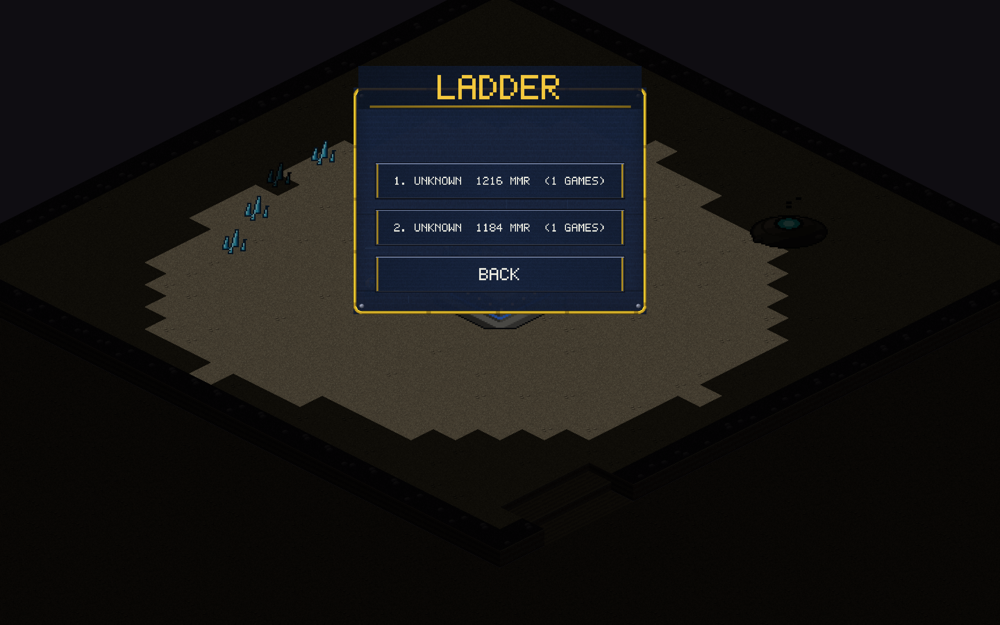

# v0.5.0 — The ladder, a balance pass, and a polish sweep

The ranked loop gets its payoff, the races get re-tuned for the
expansion era, and every screen got a professional once-over.

## Ladder

- **LADDER** on the multiplayer page: top 10 ranked players by Elo with
  game counts, your own row marked `< YOU`, fetched live from the relay.
- The matchmaker now remembers display names, and `GET /leaderboard`
  serves the top 25 (ranked games only).

## Balance

The v0.3.0 bot upgrades (expansions, siege micro, storms, multi-side
approach pathing) had quietly swung cross-race winrates to 68% Kyth.
Measured at Hard across both maps (8 seeds per matchup per map) and
re-tuned:

| Change | Why |
|---|---|
| Trooper damage 6 → 7 | VC's core ranged unit now kills a Skitter in 6 hits, not 7 |
| Skitter cost 40 → 45 | The swarm's cost-efficiency curve was unmatched |
| Ravager HP 200 → 180 | The late-game splash wall was over-durable |
| Breaker sieged damage 35 → 40 | VC's anti-swarm answer hits like it should |

After tuning: **41/59 VC/Kyth overall**, with clear map personalities —
VC favors Meridian's single-base brawls, Kyth thrives in Caverns' long
two-base games. Further evening will come from bot micro (VC tank
defense), not more stat hammering.

## Polish sweep

- Settings finally fits on one screen (compact rows; BACK was off the
  bottom edge at default HUD scale) and every label aligns with its row.
- `R: PLAY AGAIN` no longer appears (or fires) in multiplayer and
  replays — it silently abandoned MP sessions into a bot game.
- All Plasma Storm costs in the UI derive from the sim constant (two
  more stale "75 energy" strings were hiding in the card + tooltip).
- Requirement hints shorten to the building's last word — no more
  "NEEDS MUSTE" mid-word truncation.
- End-of-match stats spell out MINERALS / PLASMA; multiplayer copy sits
  inside its dialog panel; replay-load errors show on the Replays page;
  the main menu carries a version stamp.
- Selection + command audio acknowledgments (from v0.4.3) round out the
  feel: every click answers.
