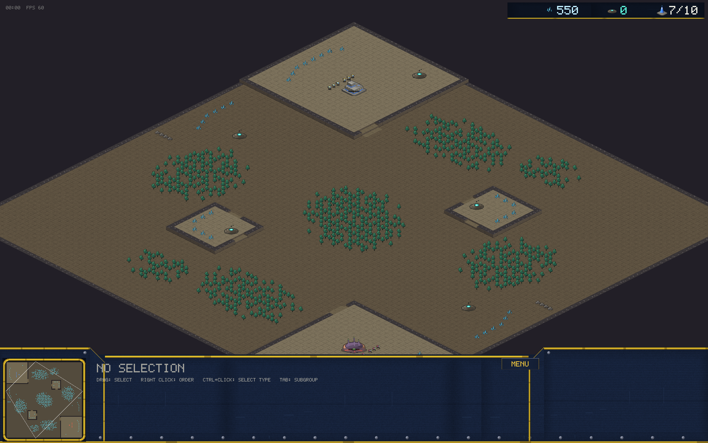
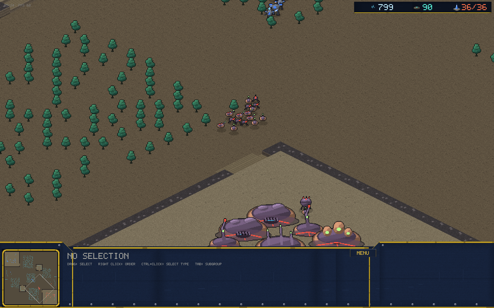

# v0.8.0 / v0.8.1 — Thornwood

*(v0.8.1: forest placement rewritten from rectangular bands to organic
elliptical groves — dense ragged cores, doubled tree count, same
squeeze-through guarantee. Screenshots show v0.8.1.)*: forests you can chop, sight you can deny

The third map, and the terrain system that makes it interesting.

## Destructible forests

- **Thorn trees** block their tile *and* line of sight. Fog runs a
  Bresenham occlusion pass: a tile is hidden when the ray from your unit
  crosses a standing tree — so a forest is a wall of shadows an army can
  physically squeeze through the gaps of, but never see through.
- **Flyers cross and see over everything** — scouting the woods is what
  air is for.
- Trees and rock walls are killable by an explicit attack order (units
  never waste shots on them automatically). Felling a tree opens the
  tile and the sightline; rock walls seal back-door corridors until
  someone commits to breaking them.
- Locked by test: sight blocked behind a tree wall, the tree itself
  visible, chop it down, path and vision open.

## The map

96x96, the busy one: high-ground mains, naturals, **contested third
bases sitting on defensible high-ground perches**, rock-sealed back
doors on the flanks, and three sparse forest bands (368 trees, spacing
audited) shaping every approach. Exactly 180-degree symmetric — the
symmetry audit now covers trees and rocks too.

## Observer camera

`--record-follow` turns the frame recorder into an observer: the camera
snaps to the mean of live attack events, lingers on the aftermath, and
drifts to the densest army clump during lulls. The README's GIF is now
real battle footage on Thornwood instead of a static overview.
