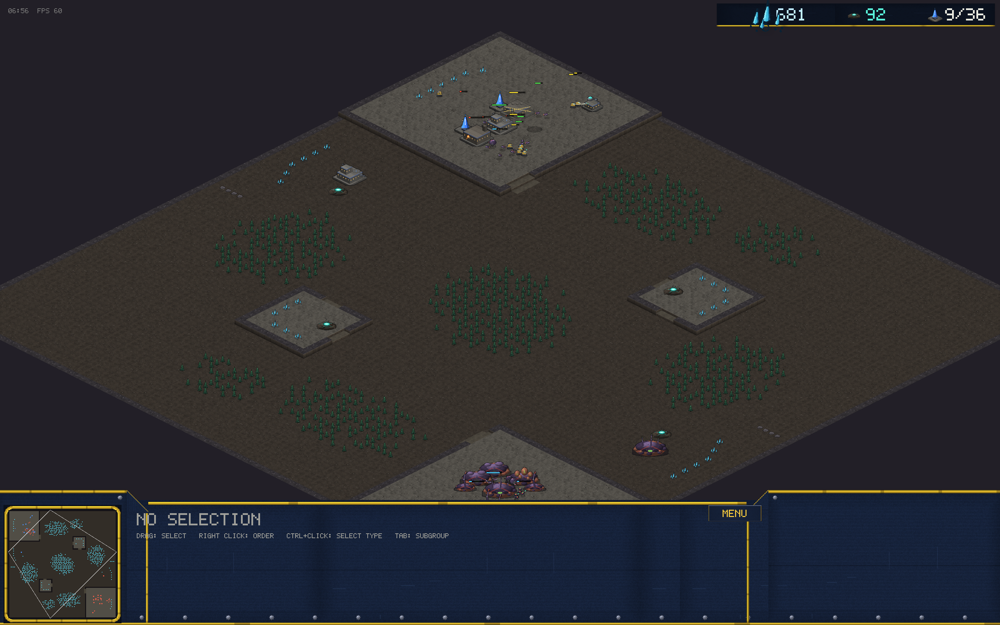
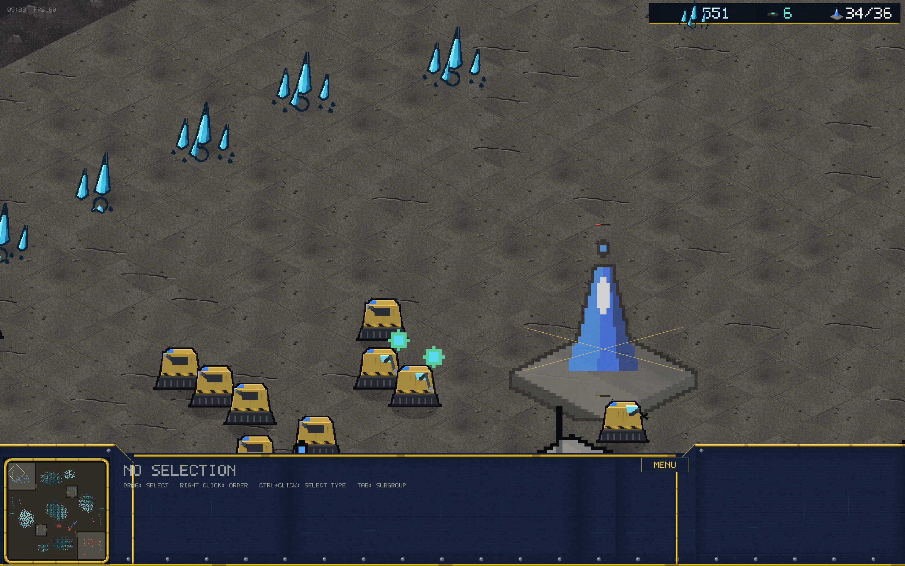
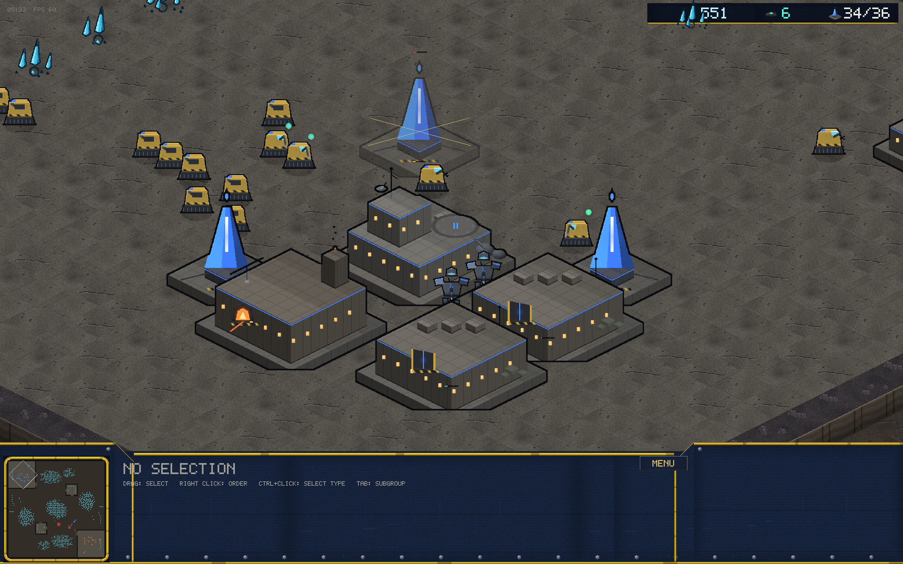
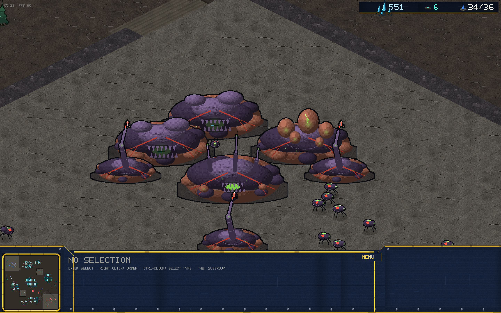
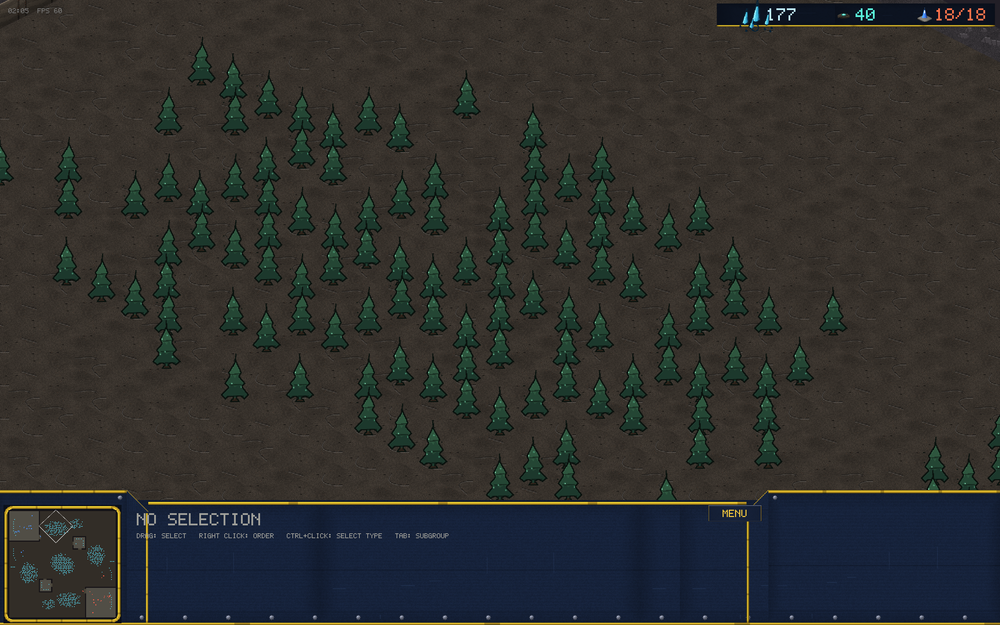

# v0.9.0 — The Graphics Overhaul

Every sprite in the game was repainted from scratch. No mechanics changed
in this release — same sim, same balance, same maps — but nothing looks
the same.

## What changed

**Four times the resolution.** The entire procedural atlas moved from
1x/2x painting to 4x supersampled sprites on a 4096 atlas, with a
per-region scale so the renderer mixes densities freely. At the default
zoom on a retina display, sprites are now texel-perfect instead of
showing chunky 4x4 blocks per painted pixel.

**A new art direction: futuristic, dystopian.** The palette drops into
dark ashen wasteland tones. Low ground is cracked ash with sparse debris
and rust; high ground reads as scorched concrete slabs with plating
seams; cliffs got noise-warped strata, rusted girder insets and a depth
fade. Ground detail is deliberately low-contrast — units and buildings
carry the light.

**Hard-edged units.** Soft ellipse blobs are gone. Vanguard units are
built from angular armor plates: faceted carapaces, kill-spiked
pauldrons, glow-cell rifles, energy blades with white-hot cores, treaded
tanks with muzzle brakes, delta gunships with flaring engines. Kyth
units are hard chitin: scalloped plate edges, jointed legs, scythe
mandibles, acid-glow organs.

**Buildings with presence.** Vanguard structures use a new iso kit —
panel-seamed walls, emissive team trim, glowing amber windows, hazard
chevrons, furnace maws, landing pads with team light rings, antenna
strobes. Kyth structures are mottled organic mounds with embedded
forking veins, toothed maws, twisted vent spires and glowing spiracles.

**Sharper forests and resources.** Trees became serrated alien conifers
with bioluminescent specks; minerals hard-faceted crystal shards with
internal glow; geysers lumpy slag mounds with glowing fissure veins.

**Effects.** Anti-aliased shadows and selection rings, glowing muzzle
flashes, scorched-debris corpses, angular plate rubble.

## Notes

- The README GIF was re-recorded on the new art.
- Minimap palette matches the new terrain.
- HUD portraits, queue icons and command card icons render from the same
  repainted sprites at full resolution.
